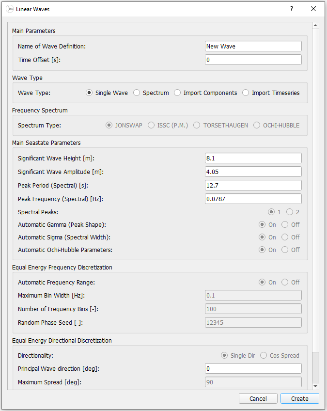
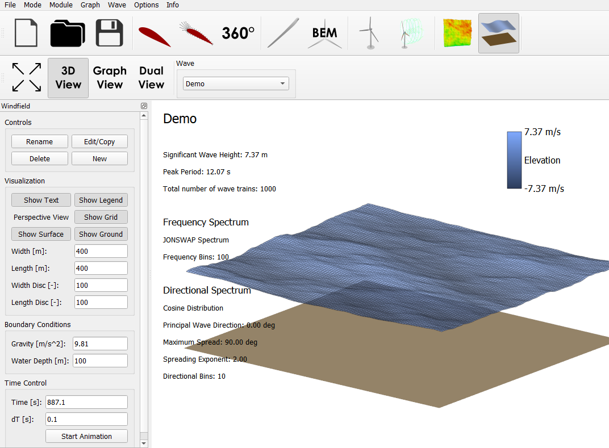

Ocean Wave Generator
====================

If an offshore simulation with the consideration of wave excitation is being carried out, it is necessary to provide the information about the sea sate in form of
a wave field. The field may eiher consist of a single wave train (regular wave) or multiple, superpositioned regular waves - (irregular waves). Both types may be generated
directly in QBlade. A third possibility is the definition of a prescribed sea state, allowing to import externally generated wave fields. The three functionalaties are described
in more detailed below. The underlying theory implemted in QBlade is described in :ref:`Sea`.

Any wave field generated in QBlade requires that a new wave is created in the *Controls* box. In the opening dialogue, the *Linear Waves* dialogue, the wave is characterized in three parameter
boxes. In the Main Parameters box, the wave train is defined (amplitude and frequency). The Equal Energy Frequency Discretization box allows to tune the discritzation parameters of the energy spectrum. Finally, the Equal Energy Directional
Discretization box lets the user definedirectional properties of the wave

Regular Wave
------------
To generate a regular wave, the wave type *Single Wave* has to be chosen in the *Linear Waves* dialoge. The user is now given the option to characterize the single wave train with the
remaining available inputs. Mainly defining the shape of the airy wave and the direction.

.. _fig-regwave:

    Definition of a single regular wave in the Ocean Wave Generator.

Main Parameters

* **Time Offset**: time shift of the generated wave signal.
* **Significant Wave Height**: Height of wave train to be generated (directly linked to amplitude).
* **Significant Wave Amplitude**: Amplitude of the wave (directly linked to wave height).
* **Peak Period**: Period of the wave (direclty linkt to wave frequency).
* **Peak Frequency**: Frequency of the wave (direclty linkt to the wave period).

Equal Energy Directional Discretization:

* **Principal Wave Direction**: Incoming wave direction.

Irregular Wave Field
--------------------
To generate an irregular wave field, the wave type *Spectrum* has to be chosen. The user is now given the option to characterize the wave field
with the remaining available inputs. Additionally to the wave train characterization discussed above, spectra discretization options can be selected.

.. _fig-irregwave_user:
.. figure:: irregwave_dialogue.png
    :align: center
    :scale: 70%
    :alt: Iregular wave creation dialogue in QBlade.

    Definition of a irregular wave field in the Ocean Wave Generator.

Main Parameters

* **Time Offset**: Time shift of the generated wave signal.
* **Significant Wave Height**: Wave height defining shape of the wave spectrum (directly linked to amplitude).
* **Significant Wave Amplitude**: Wave amplitude defining shape of the wave spectrum (directly linked to height).
* **Peak Period**: Peak period of the wave spectrum (direclty linkt to wave frequency).
* **Peak Frequency**: Peak frequency of the wave spectrum (direclty linkt to the wave period).
* **Automatic Gamma**: Automatic or manual definition of peak shape factor of the spectrum.
* **Automatic Sigma**: Automatic or manual definition of the spectral width parameter.

Equal Energy Frequency Discretization

* **Maximum Bin Width**: Maximum frequency range of the spectrum discretization.
* **Number of Frequency Bins**: Resolution of frequency discretization of the energy spectrum.
* **Random Phase Seed**: The random seed assigning the wave train phases.

Equal Energy Directional Discretization:
Either a unidriectional irregular wave field (Single Dir) or multidirectional wave field (Cos Spread) can be selected

* **Principal Wave Direction**: Definition of the wave direction (unidriectional spectrum) or of the principal direction of the cosine spectrum.
* **Maximum Spread**: Definition of the width of the cosine spectrum.
* **Spreading Exponent**: Shape defining parameter for the directional spectrum
* **Number of Directional Bins**: Resolution of angular discretization of the directional spectrum.

Prescribed Wave Field
---------------------
If the simulation should contain wave information of a pre-defined waveield, the type *Prescribed* has to be chosen. Via the appearing button *Load Wave File* a ``.txt`` file containing the
wave train information may be impoted.  This file must contain `Frequency [Hz]`, `Amplitude [m]`, `Phase [deg]` and  `Direction [deg]` infomation of the airfoil in four columns.
Once loaded in, the button *View Wave File* appears allowing to check the correctness of imported data.

Visualization
-------------
After a wave field has been created, visual and quantative evaluation can be carried out in the *3D* View or *Graph View* display window. A time resolved animation of
the wave field can be carried out in the *Time control* box.

Import and Export Functionality
-------------------------------
QBlade allows to imopt and export wave fields either in the four column format descirbed in :ref:`Prescribed Wave Field` or in a ``.Iwa`` format. This functionality
can be found in the menu toolbar below the *Wave* tab.

.. _fig-vis:

    Visualization of a demonstrational wavefield.

.. footbibliography::

