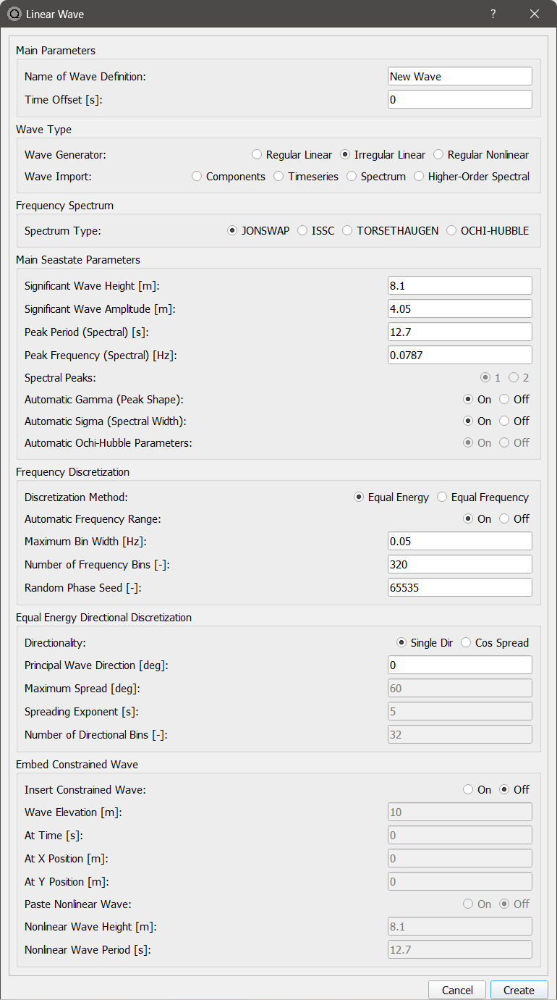
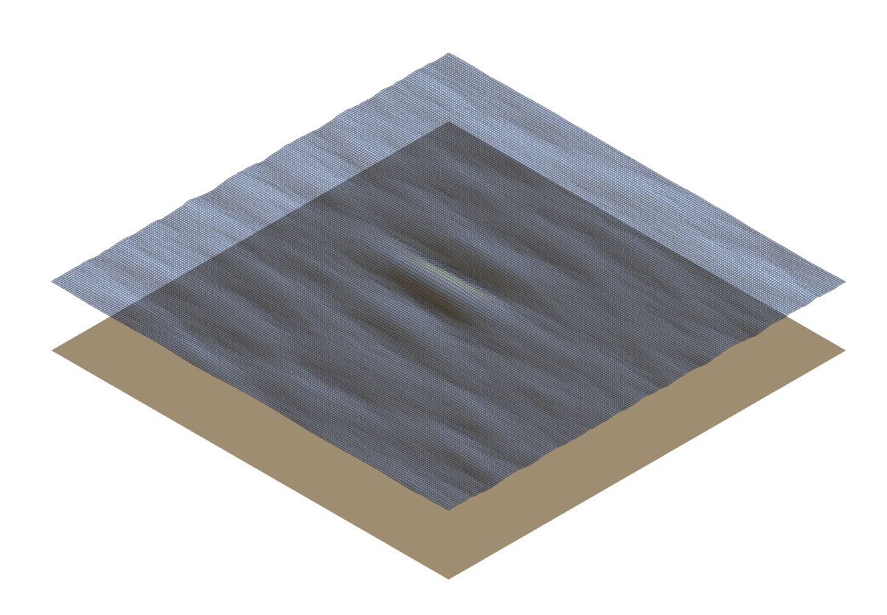

Wave Generator Overview
-----------------------

.. _fig-wave-module:

    The wave generation module in QBlade's main tool bar. 

If an offshore simulation where the consideration of wave excitation is being carried out, it is necessary to provide the information about the sea sate in the form of
a wave field. The field may either consist of a single wave train (regular wave) or multiple, superpositioned regular waves - (irregular waves). Both types may be generated
directly in QBlade. A third possibility is the definition of a prescribed sea state, allowing the user to import externally generated wave fields. The three functionalities are described
in more detailed below. The underlying theory implemented in QBlade is described in the :ref:`Waves` section of the theory guide.

Any wave field generated in QBlade requires that a new wave is created by selecting this option in the *Controls* box. 
This opens the *Linear Waves* dialogue, where the wave generation options are displayed. 
In the *Main Seastate Parameters* box, the wave train is defined (amplitude and frequency). 
The *Equal Energy Frequency Discretization* box allows the user to tune the discretization parameters of the energy spectrum. 
Finally, the *Equal Energy Directional Discretization* box lets the user define directional properties of the wave.

.. _fig-irregwave_user:

    The wave generator dialog in QBlade.

Regular Linear Wave
-------------------

.. _fig-regular-wave:

    Visualization of a regular wave.

To generate a regular wave, the wave type *Regular Linear* has to be chosen in the *Linear Wave* dialogue. 
The user now has the option to characterize the single wave train with the remaining available inputs. 
These parameters define the shape and direction of an Airy wave (see :ref:`Linear Wave Theory`).

**Main Parameters**

* **Time Offset**: Time shift of the generated wave signal
* **Significant Wave Height**: Height of wave train to be generated (directly linked to amplitude)
* **Significant Wave Amplitude**: Amplitude of the wave (directly linked to wave height)
* **Peak Period**: Period of the wave (directly linked to wave frequency)
* **Peak Frequency**: Frequency of the wave (directly linked to the wave period)

**Equal Energy Directional Discretization**

* **Principal Wave Direction**: Incoming wave direction

Regular Nonlinear Wave
----------------------

.. _fig-regular-nonlinear-wave:

    Visualization of a regular nonlinear wave.

To generate a regular nonlinear wave, the wave type *Regular Nonlinear* has to be chosen in the *Linear Wave* dialogue. The user now has the option to characterize the nonlinear wave with the remaining available inputs. These parameters define the shape and direction of a nonlinear Streamfunction Wave. The Streamfunction waves are automatically generated using the `CN-Stream <https://github.com/LHEEA/CN-Stream>`_ library from LHEAA (see the work of G. Ducrozet et al. :footcite:`cnstream`)

**Main Parameters**

* **Time Offset**: Time shift of the generated wave signal
* **Significant Wave Height**: Height of wave train to be generated (directly linked to amplitude)
* **Significant Wave Amplitude**: Amplitude of the wave (directly linked to wave height)
* **Peak Period**: Period of the wave (directly linked to wave frequency)
* **Peak Frequency**: Frequency of the wave (directly linked to the wave period)

**Equal Energy Directional Discretization**

* **Principal Wave Direction**: Incoming wave direction

**Please note** that nonlinear waves cannot be used to obtain hydrodynamic forces from :ref:`Linear Potential Flow Theory` , but are only suited to model :ref:`Morison Equation` based hydrodynamic forces.

Irregular Linear Wave
---------------------

.. _fig-irregular-wave:

    Visualization of an irregular wave.

To generate an irregular wave, the wave type *Irregular Linear* has to be chosen. The user is now given the option to characterize the wave with the remaining available inputs. In addition to the wave train characterization discussed above, spectra discretization options can be specified.

**Main Parameters**

* **Time Offset**: Time shift of the generated wave signal
* **Significant Wave Height**: Wave height defining shape of the wave spectrum (directly linked to amplitude)
* **Significant Wave Amplitude**: Wave amplitude defining shape of the wave spectrum (directly linked to height)
* **Peak Period**: Peak period of the wave spectrum (directly linked to wave frequency)
* **Peak Frequency**: Peak frequency of the wave spectrum (directly linked to the wave period)
* **Automatic Gamma**: Automatic or manual definition of peak shape factor of the spectrum
* **Automatic Sigma**: Automatic or manual definition of the spectral width parameter

**Frequency Discretization**

* **Discretization Method**: The options are equal energy or equal frequency discretization of the wave spectrum
* **Maximum Bin Width**: Maximum frequency range of the spectrum discretization.
* **Number of Frequency Bins**: Resolution of frequency discretization of the energy spectrum.
* **Random Phase Seed**: The random seed assigning the wave component phase data.

**Equal Energy Directional Discretization**

.. _fig-irregular-multi-wave:

    Visualization of an irregular multi-directional wave.

Either a unidirectional irregular wave (Single Dir) or multidirectional wave (Cos Spread) can be created

* **Principal Wave Direction**: Definition of the wave direction (unidirectional spectrum) or of the principal direction of the cosine spectrum.
* **Maximum Spread**: Definition of the width of the cosine spectrum.
* **Spreading Exponent**: Shape defining parameter for the directional spectrum
* **Number of Directional Bins**: Resolution of angular discretization of the directional spectrum.

**Embedded Constrained Wave**

.. _fig-irregular-multi-constrained-wave:

    A 30m constrained wave embedded in an irregular multi-directional wavefield.

QBlade also allows to embed a constrained wave into an irregular wavefield. This process is based on the *NewWave* method of Taylor :footcite:`Taylor97` and follows the implementation that is as laid out in :footcite:t:`RecFAST`. The main use of this functionality is to reduce the required simulation time until a *design wave* event occurs. The extreme wave that is embedded hereby is conditioned on the underlying wave spectrum and is indistinguishable from a naturally occurring extreme wave.

It is highly suggested to use an *Equal Frequency* discretization, with sufficient wave trains when embedding a constrained wave.

* **Wave Elevation**: The elevation of the embedded wave
* **At Time**: The time at which the extreme wave occurs
* **At X Position**: The X position at which the extreme wave occurs
* **At Y Position**: The Y position at which the extreme wave occurs

Furthermore, it is possible to *copy-paste* a nonlinear regular wave over the constrained wave. This process is carried out in a similar way as described in the work by P. J. Rainey at al. :footcite:`Rainey_2007`. It is only possible to copy-paste a nonlinear wave over a constrained wave in a unidirectional wavefield. The user has to specify the following parameters of the embedded nonlinear wave:

* **Nonlinear Wave Height**: The wave height of the pasted nonlinear wave
* **Nonlinear Wave Period**: The period of the nonlinear wave

**Please note** that the *Nonlinear Wave Height* parameter is not the same as the *Wave Elevation* parameter that was specified for the constrained wave. The actual wave elevation of the pasted nonlinear wave also depends on other factors, such as the water depth.

.. _fig-pasted-wave:
.. figure:: pasted_wave.png
    :align: center
    :alt: An example of a nonlinear regular wave, pasted over a linear constrained wave in an irregular unidirectional wavefield.

    An example of a nonlinear regular wave, pasted over a linear constrained wave in an irregular unidirectional wavefield.
    
.. _fig-nonlinear-pasted-wave:

    Timetrace of wave elevation of the pasted nonlinear regular wave (in red), pasted over a linear constrained wave (in blue).
    
Nonlinear wave models in offshore wind turbine simulations offer enhanced accuracy by more realistically representing extreme sea states and complex wave interactions. The technique of pasting nonlinear waves into linear seas enables precise analysis of specific severe wave conditions without requiring extensive simulations to encounter such events naturally. This leads to more accurate predictions of structural loads, crucial for ensuring the safety and structural integrity of turbines, and facilitates more robust turbine design and risk assessment under challenging conditions.

**Please note** that nonlinear waves cannot be used to obtain hydrodynamic forces from :ref:`Linear Potential Flow Theory` , but are only suited to model :ref:`Morison Equation` based hydrodynamic forces.

Import Components
-----------------
By selecting this option the user can import a wave using wave component data.
when this option is selected a button appears *Import Components File* which allows the user to import a ``.txt`` file containing the wave component information.  
This file must contains frequency [Hz], amplitude [m], phase [deg] and direction [deg] information of the wavefield in four columns. 
This data represents the frequency domain information of the wave. This is inverse Fourier-transformed in order to specify a time-series of the wave data.
Once calculated, the button *View Wave File* appears allowing the user to visually check the imported data.

Import Timeseries
-----------------
By selecting this option the user can import a wave using a time series of the wave height. 
A discrete Fourier transform (DFT) is applied to the timeseries in order to represent the data in the frequency domain.
An inverse Fourier transform (IFT) is then applied to the Fourier coefficient in order to recreate the time-series data.
A set of parameters must be specified for the DFT which gives the user some control of the wave components that are generated by the DFT.
These parameters include:

* **Low Cut-Off Frequency**: The minimum frequency considered in the DFT, below which wave components are discarded (approximately low-pass filtering). 
* **High Cut-Off Frequency**: The maximum frequency considered in the DFT, above which wave components are discarded (approximately high-pass filtering). 
* **Signal Sampling Rate**: The frequency with which data from the time series is sampled before the DFT is performed. This allows the user to reduce the number of wave components that will be generated by the DFT. 
* **Amplitude Threshold**: The minimum wave component amplitude allowed after the DFT is performed. This allows the user to filter out wave components with insignificant amplitude and thereby helps to reduce the number of generated wave components.

Import and Export Functionality
-------------------------------
QBlade allows the user to import and export wave fields either in the four column format described in :ref:`Import Components` or in a ``.Iwa`` format. 
The ``.Iwa`` format contains all of the parameters necessary to define the time and frequency domain descriptions of a wave.
This functionality can be found in the menu toolbar below the *Wave* tab. 

Wave Definition ASCII File
--------------------------

An exemplary ``.lwa`` file is shown below:

.. code-block:: console
	:caption: : A wave exported in ASCII format

	----------------------------------------QBlade Wave Definition File-------------------------------------------------
	Generated with : QBlade IH v2.0.7-release_candidate_beta windows
	Archive Format: 310023
	Time : 15:05:06
	Date : 15.05.2024

	----------------------------------------Object Name-----------------------------------------------------------------
	Pasted-Nonlinear-Wave                    OBJECTNAME         - the name of the linear wave definition object

	----------------------------------------Main Parameters-------------------------------------------------------------
	0.000                                    TIMEOFFSET         - the time offset from t=0s [s]
	3                                        WAVETYPE           - wave type: 0=TIMESERIES, 1=COMPONENT, 2=SINGLE, 3=JONSWAP, 4=ISSC, 5=TORSETHAUGEN, 6=CUSTOM, 7=STREAMFUNCTION
	8.100                                    SIGHEIGHT          - the significant wave height (Hs) [m]
	12.700                                   PEAKPERIOD         - the peak period (Tp) [s]
	true                                     AUTOGAMMA          - use gamma according to IEC (bool): 0 = OFF, 1 = ON (JONSWAP & TORSE only) [bool]
	1.000                                    GAMMA              - custom gamma (JONSWAP & TORSE only)
	true                                     AUTOSIGMA          - use sigmas according to IEC (JONSWAP & TORSE only) [bool]
	0.070                                    SIGMA1             - sigma1 (JONSWAP & TORSE only)
	0.090                                    SIGMA2             - sigma1 (JONSWAP & TORSE only)
	0                                        DOUBLEPEAK         - if true a double peak TORSETHAUGEN spectrum will be created, if false only a single peak (TORSE only)
	true                                     AUTOORCHI          - automatic OCHI-HUBBLE parameters from significant wave height (OCHI only) [bool]
	0.077                                    MODFREQ1           - modal frequency 1, must be "< modalfreq1 * 0.5" (OCHI only)
	0.133                                    MODFREQ2           - modal frequency 2, should be larger than 0.096 (OCHI only)
	6.804                                    SIGHEIGHT1         - significant height 1, should be larger than height 2 (OCHI only)
	4.374                                    SIGHEIGHT2         - significant height 2 (OCHI only)
	3.000                                    LAMBDA1            - peak shape 1 (OCHI only)
	0.932                                    LAMBDA2            - peak shape 2 (OCHI only)

	----------------------------------------Frequency Discretization ---------------------------------------------------
	1                                        DISCTYPE           - frequency discretization type: 0 = equal energy; 1 = equal frequency
	true                                     AUTOFREQ           - use automatic frequency range (f_in = 0.5*f_p, f_out = 10*f_p) [bool]
	0.039                                    FCUTIN             - cut-in frequency
	0.787                                    FCUTOUT            - cut-out frequency
	0.050                                    MAXFBIN            - maximum freq. bin width [Hz]
	3020                                     NUMFREQ            - the number of frequency bins
	65535                                    RANDSEED           - the seed for the random phase generator range [0-65535]

	----------------------------------------Directional Discretization (Equal Energy)-----------------------------------
	0                                        DIRTYPE            - the directional type, 0 = UNIDIRECTIONAL, 1 = COSINESPREAD
	0.000                                    DIRMEAN            - mean wave direction [deg]
	60.000                                   DIRMAX             - directional spread [deg]
	5.000                                    SPREADEXP          - the spreading exponent
	32                                       NUMDIR             - the number of directional bins

	----------------------------------------Embedded Constrained Wave --------------------------------------------------
	true                                     EMBEDWAVE          - add a constrained wave [bool]
	16.00                                    EMBEDELEV          - the wave elevation of the embedded wave [m]
	0.00                                     EMBEDTIME          - the time at which the embedded wave occurs [s]
	0.00                                     EMBEDXPOS          - the x-position at which the embedded wave occurs [m]
	0.00                                     EMBEDYPOS          - the y-position at which the embedded wave occurs [m]
	true                                     PASTESTREAM        - paste a streamfunction wave over the embedded linear wave [bool]
	23.00                                    SIGHEIGHTSTREAM    - the significant height of the streamfunction wave [m]
	12.70                                    PERIODSTREAM       - the period of the stremfunction wave [s]

Merged Waves
------------

.. _fig-merged-wave:

    Visualization of a new wave merged from an irregular and a regular wave.
    
It is also possible to merge two or more linear wave definitions to create a new merged wave. The merged wave is a simple superposition of the wave components of all merged waves. The main purpose for this option is to allow the user to generate seastates that are caused both by swell and wind coming from different directions. If both spectra (swell / wind) and their direction are known a merged wave can simply be created by merging both wave definitions.

The merge wave dialog is avaiilable from the top menu, shown in :numref:`fig-merged-wave-dialog`.

.. _fig-merged-wave-dialog:

    The merged wave option in the top wave menu.
    
Merged Wave Definition ASCII File
---------------------------------
    
A merged wave definition can also be exported to or imported from a simple ASCII format, that is shown below.

.. code-block:: console
	:caption: : A merged wave exported in ASCII format

	----------------------------------------QBlade Wave Definition File-------------------------------------------------
	Generated with : QBlade CE v2.0.6_beta_dev windows
	Archive Format: 310012
	Time : 12:34:36
	Date : 18.05.2023

	----------------------------------------Object Name-----------------------------------------------------------------
	New_Merged_Wave                          OBJECTNAME         - the name of the linear wave definition object

	----------------------------------------Main Parameters-------------------------------------------------------------
	2                                        MERGEDWAVES        - the number of linear waves that are merged in this wave
	regular_wave.lwa                         WAVE_1             - the filenames of the waves that are merged
	irregular_wave.lwa                       WAVE_2             - the filenames of the waves that are merged

.. footbibliography::

