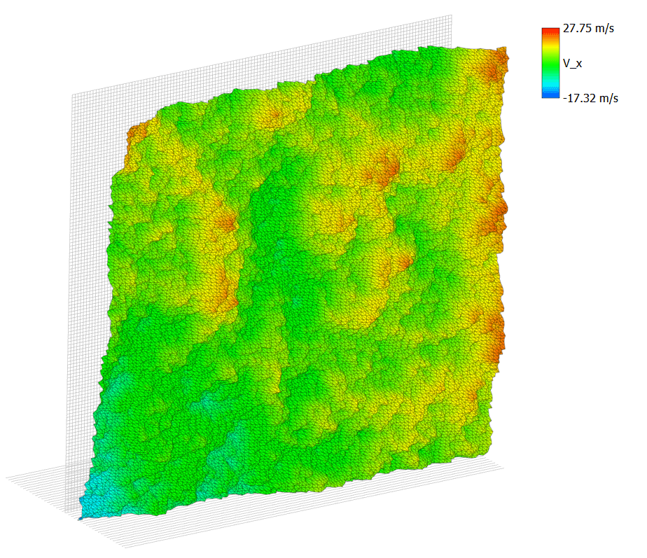
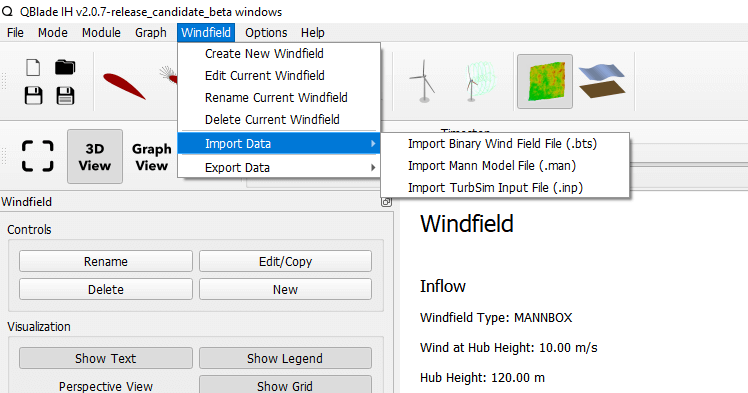

Wind Field Generator Overview
-----------------------------

.. _fig-wind-module:
.. figure:: windbutton.png
    :align: center
    :alt: Wind field creation dialogue in QBlade.

    The wind field creation symbol in the QBlade main tool bar. 

The Wind Field Generator in QBlade is essential for defining the atmospheric conditions affecting the turbine during simulations. This section provides an overview of how to generate different types of wind fields, including turbulent, uniform, and hub-height wind fields, each crucial for various simulation scenarios. Below, we describe the options available for each type of wind field and guide you through the settings and parameters necessary to tailor the wind conditions to your specific simulation needs.

Turbulent Wind Field 
--------------------

.. _fig-turb-field:

    A turbulent wind field generated in QBlade.

This section describes the process of generating a three-dimensional, fully turbulent wind field. Turbulent wind fields are essential for simulating real-world atmospheric conditions and assessing turbine performance under variable wind speeds and directions.

This can be either generated through the *Wind Input Type* button of the turbine simulation dialogue, as shown in :numref:`fig-wind-pane` or by directly generating this within the
turbulent wind module, shown in :numref:`fig-wind-module`. 

Three different options, to generate a three dimensional, fully turbulent wind field exist in QBlade.

* **TurbSim**: Generates the wind field using NREL's TurbSim binary (see B. J. Jonkman :footcite:`TurbSimGuide`).
* **Mann**: Generates the wind field using DTU`s Mann generator (see J. Mann :footcite:`mann1998`).
* **Veers**: Generates the wind field after the Veers algorithm (see P. S. Veers :footcite:`veers1988`).  

TurbSim Wind Fields
^^^^^^^^^^^^^^^^^^^
	
When a new TurbSim wind field is created, a range of parameters must be specified as shown by the wind field generator dialogue in :numref:`fig-turb-dia`.
After these have been selected, clicking on the *Create* button automatically passes the information to the TurbSim program :footcite:`TurbSimGuide`.
The TurnSim binary is automatically called by QBlade, and after creation the wind field is automatically imported, so that no additional user input is required.
The input parameters are described in detail in the following section. 

.. _fig-turb-dia:
.. figure:: turbsim_dialog.png
    :align: center
    :scale: 75%
    :alt: Turb sim wind field dialogue in QBlade.

    Turb sim wind field dialogue in QBlade.

**Main Parameters**

 These parameters dictate the spatial dimensions of the generated turbulent wind grid.
 A turbulent *box* is be generated which is then translated through the field of interest at the average velocity (defined below) 
 as is consistent with Taylor's hypothesis for a turbulent flow :footcite:`BatchelorBook`.
 
 * **Name**: The name of the wind field object.
 * **Ref. Wind Speed**: The reference wind speed of this wind field.
 * **Seed**: The random seed used to generate the wind field.
 * **Time**: Determines the length of the generated turbulent box.
 * **Timestep**: Specifies the discretisation in free stream (:math:`x`) direction.  
 * **Grid Width**: Specifies box size in lateral (:math:`y`) direction.
 * **Grid Height**: Specifies box size in vertical (:math:`z`) direction.
 * **Grid Y Points**: Specifies spatial discretisation in :math:`y` direction.
 * **Grid Z Points**: Specifies spatial discretisation in :math:`z` direction.
 * **Center (Hub) Height**: Specifies the vertical position of the box center.

**Turbine Class**

 These determine the turbine class as defined in the IEC 61400 design standard :footcite:`IEC61400-1`.
 
 * **Turbine Class**: Specifies the design turbine class.
 * **Turbulence Class**: Specifies the design turbulence class.
 * **I_ref**: Specifies the turbulence intensity.
 * **V_ref**: Specifies the reference velocity.
 * **b**: The *b* parameter, used to calculate the turbulence standard deviation in IEC 61400.

**Wind Parameters**

 These parameters specify the parameters and model inputs required for generation of the turbulent velocity field. 
 
 * **IEC Standard**: Specifies the version of the IEC standard, used to generate the wind field.
 * **Wind Type**: Specifies the wind field type of the generated wind field.
 * **Spectral Model**: Specifies the form of the spectral tensor applied to generate the stochastic velocity fluctuations.
 * **Wind Profile Type**: Specifies the model used to represent the atmospheric shear layer.
 * **Reference Height**: Specifies the reference height of the aforementioned shear layer model.
 * **Shear Exponent**: Specifies the shear exponent of the aforementioned shear layer model (if exponential model chosen).
 * **Roughness Length**: Specifies the reference height of the aforementioned shear layer model (if logarithmic model chosen).
 * **Jet Height**: Specifies the jet height of the aforementioned shear layer model (if jet model chosen).
 * **ETMC value**: Specifies the extreme turbulence model :math:`c` value (if ETM model chosen).
 * **Remove TurbSim Files**: If checked, the TurbSim files generated and subsequently read by QBlade, are automatically deleted.
 * **Close Console**: If checked, the console which is called to generate the TurbSim file is automatically closed upon completion of TurbSim file generation. 
    
Mann Wind Fields
^^^^^^^^^^^^^^^^
	
When a new Mann wind field is created, a range of parameters must be specified as shown by the wind field generator dialogue in :numref:`fig-mann-dia`.
After these have been selected, clicking on the *Create* button automatically passes the information to `DTU's Mann 64bit Turbulence Generator <https://www.hawc2.dk/install/standalone-mann-generator>`_.
The Mann binary is automatically called by QBlade, and after creation the wind field is automatically imported, so that no additional user input is required. **Please note** that the Mann 64bit generator currently is only available for Windows operating systems.
The input parameters are described in detail in the following section. 

.. _fig-mann-dia:
.. figure:: mann_dialog.png
    :align: center
    :scale: 75%
    :alt: Mann wind field dialogue in QBlade.

    Mann wind field dialogue in QBlade.

**Main Parameters**

 These parameters dictate the spatial dimensions of the generated turbulent wind grid.
 A turbulent *box* is be generated which is then translated through the field of interest at the average velocity (defined below) 
 as is consistent with Taylor's hypothesis for a turbulent flow :footcite:`BatchelorBook`.
 
 * **Name**: The name of the wind field object.
 * **Ref. Wind Speed**: The reference wind speed of this wind field.
 * **Seed**: The random seed used to generate the wind field.
 * **Time**: Determines the length of the generated turbulent box.
 * **Timestep**: Specifies the discretisation in free stream (:math:`x`) direction.  
 * **Grid Width**: Specifies box size in lateral (:math:`y`) direction.
 * **Grid Height**: Specifies box size in vertical (:math:`z`) direction.
 * **Grid Y Points**: Specifies spatial discretisation in :math:`y` direction (must be power of 2).
 * **Grid Z Points**: Specifies spatial discretisation in :math:`z` direction (must be power of 2).
 * **Center (Hub) Height**: Specifies the vertical position of the box center.

**Turbine Class**
 
 These determine the turbine class as defined in the IEC 61400 design standard :footcite:`IEC61400-1`.
 
 * **Turbine Class**: Specifies the design turbine class.
 * **Turbulence Class**: Specifies the design turbulence class.
 * **I_ref**: Specifies the turbulence intensity.
 * **V_ref**: Specifies the reference velocity.
 * **b**: The *b* parameter, used to calculate the turbulence standard deviation in IEC 61400.

**Wind Parameters**
 
 These parameters specify the parameters and model inputs required for generation of the turbulent velocity field. 
 
 * **IEC Standard**: Specifies the version of the IEC standard, used to generate the wind field.
 * **Wind Type**: Specifies the wind field type of the generated wind field.
 * **Spectral Model**: Specifies the form of the spectral tensor applied to generate the stochastic velocity fluctuations.
 * **Wind Profile Type**: Specifies the model used to represent the atmospheric shear layer.
 * **Reference Height**: Specifies the reference height of the aforementioned shear layer model.
 * **Shear Exponent**: Specifies the shear exponent of the aforementioned shear layer model (if exponential model chosen).
 * **Roughness Length**: Specifies the reference height of the aforementioned shear layer model (if logarithmic model chosen).
 * **ETMC value**: Specifies the extreme turbulence model :math:`c` value (if ETM model chosen).

**Mann Box Parameters**
 
 * **Alpha Epsilon**: The Mann model :math:`\alpha\epsilon^{\frac{2}{3}}` parameter.
 * **L Mann**: The Mann length scale parameter.
 * **Gamma**: The non-dimensional shear distortion parameter.     
 * **High Freq. Compensation**: If checked: applies the high frequency compensation, so that point velocities represent local anemometer measurements.
 * **Scale to Turbulence**: If checked: scales the Mann box turbulence to the defined IEC turbulence, multiplied by the parameters described below
 * **X-Scale Factor**: Scales the longitudinal turbulence along the x-axis to the IEC turbulence, mutiplied by this value.
 * **Y-Scale Factor**: Scales the transversal turbulence along the y-axis to the IEC turbulence, mutiplied by this value.
 * **Z-Scale Factor**: Scales the transversal turbulence along the z-axis to the IEC turbulence, mutiplied by this value.

Veers Wind Fields
^^^^^^^^^^^^^^^^^
	
When a new Veers wind field is created, a range of parameters must be specified as shown by the wind field generator dialogue in :numref:`fig-veers-dia`.
After these have been selected, clicking on the *Create* button automatically generates a wind field using the Veers method build into QBlade (see P. Veers :footcite:`veers1988`).
The input parameters are described in detail in the following section. 

.. _fig-veers-dia:
.. figure:: veers_dialog.png
    :align: center
    :scale: 75%
    :alt: Veers wind field dialogue in QBlade.

    Veers wind field dialogue in QBlade.

**Main Parameters**

 These parameters dictate the spatial dimensions of the generated turbulent wind grid.
 A turbulent *box* is be generated which is then translated through the field of interest at the average velocity (defined below) 
 as is consistent with Taylor's hypothesis for a turbulent flow :footcite:`BatchelorBook`.
 
 * **Name**: The name of the wind field object.
 * **Ref. Wind Speed**: The reference wind speed of this wind field.
 * **Seed**: The random seed used to generate the wind field.
 * **Time**: Determines the length of the generated turbulent box.
 * **Timestep**: Specifies the discretisation in free stream (:math:`x`) direction.  
 * **Grid Height & Width**: Specifies box size in horizontal (:math:`y`) and vertical (:math:`z`) direction.
 * **Grid Y & Z Points**: Specifies spatial discretisation in :math:`y` and :math:`z` direction 
 * **Center (Hub) Height**: Specifies the vertical position of the box center.

**Wind Parameters**

 These parameters specify the parameters and model inputs required for generation of the turbulent velocity field. 
 
 * **Turbulence Intensity**: The target turbulence intensity.
 * **Wind Profile Type**: Specifies the model used to represent the atmospheric shear layer.
 * **Reference Height**: Specifies the reference height of the aforementioned shear layer model.
 * **Shear Exponent**: Specifies the shear exponent of the aforementioned shear layer model (if exponential model chosen).
 * **Roughness Length**: Specifies the reference height of the aforementioned shear layer model (if logarithmic model chosen).   
 
Importing Turbulent Wind Fields
^^^^^^^^^^^^^^^^^^^^^^^^^^^^^^^

.. _fig-import-wind:

    Import options in the wind field menu.
    
It is also possible to import externally generated three dimensional wind fields into QBlade, see :numref:`fig-import-wind`. Wind fields can be imported in three ways:

Binary Wind Field File
**********************
A wind field file in binary format (.bts) (see TurbSim Users Guide :footcite:`TurbSimGuide`) can be imported by simply reading the .bts file.

Mann Model File
***************
A Mann box can be imported through the Mann (.man) file format, shown below. 

If the parameter **IMPORTBOX** is set to *false*, QBlade will automatically generate a Mann wind box with the parameters specified in the .man file. 

If the parameter **IMPORTBOX** is set to *true*, QBlade will search for the (possibly externally generated) files:

 * *PREFIX* _u.bin
 * *PREFIX* _v.bin
 * *PREFIX* _z.bin

An import the velocity components from these binary files directly.

.. code-block:: console
	:caption: : Exemplary Mann (.man) format file

	----------------------------------------QBlade Mann Box Definition File--------------------------------------------
	Generated with : QBlade EE v2.0.7.4_beta windows
	Archive Format: 310024
	Time : 13:53:10
	Date : 14.07.2024
	
	----------------------------------------Parameters-----------------------------------------------------------------
	Windfield                                PREFIX             - prefix of the .bin and other files generated
	false                                    IMPORTBOX          - false: generate new box from parameters; true: try to find and read .bin files with prefix
	
	120.000                                  HEIGHTBOX          - height of the mann box center in [m]
	630.000                                  XDIM_BOX           - length of the mann box in [m]
	240.000                                  YDIM_BOX           - width of the mann box in [m]
	240.000                                  ZDIM_BOX           - height of the mann box in [m]
	631                                      NX_BOX             - number of points along length, must be power of 2 [-]
	32                                       NY_BOX             - number of points along width, must be power of 2 [-]
	32                                       NZ_BOX             - number of points along width, must be power of 2 [-]
	
	120.000                                  REFHEIGHT          - reference height for the BL profile in [m]
	0                                        PROFILETYPE        - BL profile type: 0- power law; 1 - logarithmic
	0.200                                    PROFILEPARAM       - power law exponent or roughness length
	
	0.0660                                   ALPHA_EPSILON      - Mann alpha-epsilon parameter
	29.4000                                  L_MANN             - Mann length scale [m]
	3.9000                                   GAMMA              - Mann gamma parameter
	12345                                    SEED               - turbulent seed
	
	10.000                                   WINDSPEED          - hub-height average wind speed
	
	1                                        IEC_STANDARD       - IEC standard 61400- (1, 2 or 3)
	NTM                                      IEC_WINDTYPE       - IEC wind type (NTM, ETM, EWM1, EWM50 or ADDTURB
	16.000                                   IEC_IREF           - IEC I_ref value [-]
	10.000                                   IEC_VAVE           - IEC V_ave value [m/s]
	50.000                                   IEC_VREF           - IEC V_ref value [m/s]
	5.600                                    IEC_B              - IEC b value (or a in 61400-2) [m/s]
	2.000                                    IEC_ETMC           - IEC ETM c value [m/s]
	
	true                                     TURB_SCALING       - enable turbulent scaling: 0 - OFF; 1 - ON
	true                                     HF_CORRECTION      - enable high frequency correction: 0 - OFF; 1 - ON
	
	1.000                                    X_FACTOR           - scaling factor for x-variance
	0.800                                    Y_FACTOR           - scaling factor for y-variance
	0.500                                    Z_FACTOR           - scaling factor for z-variance
 
TurbSim Input File
******************
A TurbSim input file may be directly opened in QBlade. The input file (.inp) will then automatically be communicated to the TurbSim binary and the corresponding wind field is imported.

.. code-block:: console
	:caption: : Exemplary TurbSim Input (.ipt) file
	
	!TurbSim Input File. Valid for TurbSim from OpenFAST v2.4.0. Generated with QBlade QBlade IH v2.0.7-release_candidate_beta windows on 15.05.2024 at 17:22:58

	---------Runtime Options-----------------------------------
	False               Echo            - Echo input data to <RootName>.ech (flag)
	12345               RandSeed1       - First random seed  (-2147483648 to 2147483647) 
	RANLUX              RandSeed2       - Second random seed (-2147483648 to 2147483647) for intrinsic pRNG, or an alternative pRNG: "RanLux" or "RNSNLW"
	False               WrBHHTP         - Output hub-height turbulence parameters in binary form?  (Generates RootName.bin)
	False               WrFHHTP         - Output hub-height turbulence parameters in formatted form?  (Generates RootName.dat)
	False               WrADHH          - Output hub-height time-series data in AeroDyn form?  (Generates RootName.hh)
	True                WrADFF          - Output full-field time-series data in TurbSim/AeroDyn form? (Generates Rootname.bts)
	False               WrBLFF          - Output full-field time-series data in BLADED/AeroDyn form?  (Generates RootName.wnd)
	False               WrADTWR         - Output tower time-series data? (Generates RootName.twr)
	False               WrFMTFF         - Output full-field time-series data in formatted (readable) form?  (Generates RootName.u, RootName.v, RootName.w)
	False               WrACT           - Output coherent turbulence time steps in AeroDyn form? (Generates RootName.cts)
	True                Clockwise       - Clockwise rotation looking downwind? (used only for full-field binary files - not necessary for AeroDyn)
	0                   ScaleIEC        - Scale IEC turbulence models to exact target standard deviation? [0=no additional scaling; 1=use hub scale uniformly; 2=use individual scales]

	--------Turbine/Model Specifications-----------------------
	24                  NumGrid_Z       - Vertical grid-point matrix dimension
	24                  NumGrid_Y       - Horizontal grid-point matrix dimension
	0.1000              TimeStep        - Time step [seconds]
	63.0000             AnalysisTime    - Length of analysis time series [seconds] (program will add time if necessary: AnalysisTime = MAX(AnalysisTime, usableTimeLabel+GridWidth/MeanHHWS) )
	63.0000             usableTimeLabel      - Usable length of output time series [seconds] (program will add GridWidth/MeanHHWS seconds)
	120.0001            HubHt           - Hub height [m] (should be > 0.5*GridHeight)
	240.00              GridHeight      - Grid height [m] 
	240.00              GridWidth       - Grid width [m] (should be >= 2*(RotorRadius+ShaftLength))
	0.0                 VFlowAng        - Vertical mean flow (uptilt) angle [degrees]
	0.0                 HFlowAng        - Horizontal mean flow (skew) angle [degrees]

	--------Meteorological Boundary Conditions-------------------
	"IECKAI"            TurbModel       - Turbulence model ("IECKAI"=Kaimal, "IECVKM"=von Karman, "GP_LLJ", "NWTCUP", "SMOOTH", "WF_UPW", "WF_07D", "WF_14D", "TIDAL", or "NONE")
	"unused"            UserFile        - Name secondary input file for user-defined spectra or time series inputs
	"1-ED3"             IECstandard     - Number of IEC 61400-x standard (x=1,2, or 3 with optional 61400-1 edition number (i.e. "1-Ed2") )
	"A"                 IECturbc        - IEC turbulence characteristic ("A", "B", "C" or the turbulence intensity in percent) ("KHTEST" option with NWTCUP model, not used for other models)
	"NTM"               IEC_WindType    - IEC turbulence type ("NTM"=normal, "xETM"=extreme turbulence, "xEWM1"=extreme 1-year wind, "xEWM50"=extreme 50-year wind, where x=wind turbine class 1, 2, or 3)
	2.00                ETMc            - IEC Extreme Turbulence Model "c" parameter [m/s]
	default             ProfileType     - Wind profile type ("JET";"LOG"=logarithmic;"PL"=power law;"H2L"=Log law for TIDAL spectral model;"IEC"=PL on rotor disk, LOG elsewhere; or "default")
	"unused"            ProfileFile -     Name of the file that contains user-defined input profiles
	120.00              RefHt           - Height of the reference wind speed [m]
	10.00               URef            - Mean (total) wind speed at the reference height [m/s] (or "default" for JET wind profile)
	default             ZJetMax         - Jet height [m] (used only for JET wind profile, valid 70-490 m)
	default             PLExp           - Power law exponent [-] (or "default")  
	default             Z0              - Surface roughness length [m] (or "default")

	--------Non-IEC Meteorological Boundary Conditions------------
	default             Latitude        - Site latitude [degrees] (or "default")
	0.05                RICH_NO         - Gradient Richardson number 
	default             UStar           - Friction or shear velocity [m/s] (or "default")
	default             ZI              - Mixing layer depth [m] (or "default")
	default             PC_UW           - Hub mean u'w' Reynolds stress (or "default")
	default             PC_UV           - Hub mean u'v' Reynolds stress (or "default")
	default             PC_VW           - Hub mean v'w' Reynolds stress (or "default")

	--------Spatial Coherence Parameters----------------------------
	default             SCMod1          - u-component coherence model ("GENERAL","IEC","API","NONE", or "default")
	default             SCMod2          - v-component coherence model ("GENERAL","IEC","API","NONE", or "default")
	default             SCMod3          - w-component coherence model ("GENERAL","IEC","API","NONE", or "default")
	default             InCDec1         - u-component coherence parameters [-, m^-1] ("a b" in quotes or "default")
	default             InCDec2         - v-component coherence parameters [-, m^-1] ("a b" in quotes or "default")
	default             InCDec3         - w-component coherence parameters [-, m^-1] ("a b" in quotes or "default")
	default             CohExp          - Coherence exponent for general model [-] (or "default")

	--------Coherent Turbulence Scaling Parameters-------------------
	"path/to/coh_events/eventdata"  CTEventPath     - Name of the path where event data files are located
	"Random"            CTEventFile     - Type of event files ("LES", "DNS", or "RANDOM")
	true                Randomize       - Randomize the disturbance scale and locations? (true/false)
	 1.0                DistScl         - Disturbance scale (ratio of wave height to rotor disk). (Ignored when Randomize = true.)
	 0.5                CTLy            - Fractional location of tower centerline from right (looking downwind) to left side of the dataset. (Ignored when Randomize = true.)
	 0.5                CTLz            - Fractional location of hub height from the bottom of the dataset. (Ignored when Randomize = true.)
	30.0                CTStartTime     - Minimum start time for coherent structures in RootName.cts [seconds]

	==================================================
	NOTE: Do not add or remove any lines in this file!
	==================================================

Uniform Wind Field 
------------------
A uniform wind field is specified directly within the *Wind Input Type* of the turbine simulation dialogue, shown in :numref:`fig-wind-pane` (see :doc:`../simulation/simulation`).
The necessary input parameters including velocity, horizontal inflow angle and directional shear are defined here.
In the case that the atmospheric boundary layer is to be modelled, this can be selected with the wind shear type radio button. 
The corresponding shear parameters can then by specified (see :doc:`../../theory/environment/wind/wind`). 

.. _fig-wind-pane:
.. figure:: winddialog.png
    :align: center
    :scale: 80%
    :alt: Uniform wind field creation dialogue in QBlade.

    Specification of a uniform wind field within the turbine simulation dialogue. 
	
Hub Height File
---------------
The user has more modelling freedom when a hub-height wind file is used. This type of file can either be created manually or by using the IEC wind tool :footcite:`IECwindtool`. This allows the specification of the velocity field at the hub height as a function of time. QBlade interpolates the time between the starting time of the file and the point where the predefined wind velocity profile (EOG in this case) should start. If the user specified simulation time exceeds the ending time in the hub-height file, QBlade will create a constant wind field with the parameters from the last entry of the hub-height file until the end of the simulation. An exemplary hubheight input file that described an extreme operating gust (EOG) at 20m/s is shown below:

.. code-block:: console
	:caption: : Exemplary Hub Height Format file

	Time	Wind	Horiz.	Vert.	LinH.	Vert.	LinV.	Gust
		Speed	Dir	Speed	Shear	Shear	Shear	Speed
	0.000	20.000	0.000	0.000	0.000	0.200	0.000	0.000	
	60.000	20.000	0.000	0.000	0.000	0.200	0.000	0.000	
	60.100	20.000	0.000	0.000	0.000	0.200	0.000	-0.000	
	60.200	20.000	0.000	0.000	0.000	0.200	0.000	-0.004	
	60.300	20.000	0.000	0.000	0.000	0.200	0.000	-0.012	
	60.400	20.000	0.000	0.000	0.000	0.200	0.000	-0.028	
	60.500	20.000	0.000	0.000	0.000	0.200	0.000	-0.054	
	60.600	20.000	0.000	0.000	0.000	0.200	0.000	-0.092	
	60.700	20.000	0.000	0.000	0.000	0.200	0.000	-0.144	
	60.800	20.000	0.000	0.000	0.000	0.200	0.000	-0.209	
	60.900	20.000	0.000	0.000	0.000	0.200	0.000	-0.289	
	61.000	20.000	0.000	0.000	0.000	0.200	0.000	-0.384	
	61.100	20.000	0.000	0.000	0.000	0.200	0.000	-0.493	
	61.200	20.000	0.000	0.000	0.000	0.200	0.000	-0.614	
	61.300	20.000	0.000	0.000	0.000	0.200	0.000	-0.747	
	61.400	20.000	0.000	0.000	0.000	0.200	0.000	-0.889	
	61.500	20.000	0.000	0.000	0.000	0.200	0.000	-1.037	
	61.600	20.000	0.000	0.000	0.000	0.200	0.000	-1.188	
	61.700	20.000	0.000	0.000	0.000	0.200	0.000	-1.338	
	61.800	20.000	0.000	0.000	0.000	0.200	0.000	-1.485	
	61.900	20.000	0.000	0.000	0.000	0.200	0.000	-1.622	
	62.000	20.000	0.000	0.000	0.000	0.200	0.000	-1.748	
	62.100	20.000	0.000	0.000	0.000	0.200	0.000	-1.856	
	62.200	20.000	0.000	0.000	0.000	0.200	0.000	-1.944	
	62.300	20.000	0.000	0.000	0.000	0.200	0.000	-2.007	
	62.400	20.000	0.000	0.000	0.000	0.200	0.000	-2.041	
	62.500	20.000	0.000	0.000	0.000	0.200	0.000	-2.043	
	62.600	20.000	0.000	0.000	0.000	0.200	0.000	-2.011	
	62.700	20.000	0.000	0.000	0.000	0.200	0.000	-1.942	
	62.800	20.000	0.000	0.000	0.000	0.200	0.000	-1.834	
	62.900	20.000	0.000	0.000	0.000	0.200	0.000	-1.686	
	63.000	20.000	0.000	0.000	0.000	0.200	0.000	-1.498	
	63.100	20.000	0.000	0.000	0.000	0.200	0.000	-1.271	
	63.200	20.000	0.000	0.000	0.000	0.200	0.000	-1.005	
	63.300	20.000	0.000	0.000	0.000	0.200	0.000	-0.703	
	63.400	20.000	0.000	0.000	0.000	0.200	0.000	-0.366	
	63.500	20.000	0.000	0.000	0.000	0.200	0.000	0.000	
	63.600	20.000	0.000	0.000	0.000	0.200	0.000	0.393	
	63.700	20.000	0.000	0.000	0.000	0.200	0.000	0.807	
	63.800	20.000	0.000	0.000	0.000	0.200	0.000	1.237	
	63.900	20.000	0.000	0.000	0.000	0.200	0.000	1.678	
	64.000	20.000	0.000	0.000	0.000	0.200	0.000	2.124	
	64.100	20.000	0.000	0.000	0.000	0.200	0.000	2.568	
	64.200	20.000	0.000	0.000	0.000	0.200	0.000	3.003	
	64.300	20.000	0.000	0.000	0.000	0.200	0.000	3.425	
	64.400	20.000	0.000	0.000	0.000	0.200	0.000	3.825	
	64.500	20.000	0.000	0.000	0.000	0.200	0.000	4.198	
	64.600	20.000	0.000	0.000	0.000	0.200	0.000	4.539	
	64.700	20.000	0.000	0.000	0.000	0.200	0.000	4.841	
	64.800	20.000	0.000	0.000	0.000	0.200	0.000	5.101	
	64.900	20.000	0.000	0.000	0.000	0.200	0.000	5.314	
	65.000	20.000	0.000	0.000	0.000	0.200	0.000	5.477	
	65.100	20.000	0.000	0.000	0.000	0.200	0.000	5.587	
	65.200	20.000	0.000	0.000	0.000	0.200	0.000	5.642	
	65.300	20.000	0.000	0.000	0.000	0.200	0.000	5.642	
	65.400	20.000	0.000	0.000	0.000	0.200	0.000	5.587	
	65.500	20.000	0.000	0.000	0.000	0.200	0.000	5.477	
	65.600	20.000	0.000	0.000	0.000	0.200	0.000	5.314	
	65.700	20.000	0.000	0.000	0.000	0.200	0.000	5.101	
	65.800	20.000	0.000	0.000	0.000	0.200	0.000	4.841	
	65.900	20.000	0.000	0.000	0.000	0.200	0.000	4.539	
	66.000	20.000	0.000	0.000	0.000	0.200	0.000	4.198	
	66.100	20.000	0.000	0.000	0.000	0.200	0.000	3.825	
	66.200	20.000	0.000	0.000	0.000	0.200	0.000	3.425	
	66.300	20.000	0.000	0.000	0.000	0.200	0.000	3.003	
	66.400	20.000	0.000	0.000	0.000	0.200	0.000	2.568	
	66.500	20.000	0.000	0.000	0.000	0.200	0.000	2.124	
	66.600	20.000	0.000	0.000	0.000	0.200	0.000	1.678	
	66.700	20.000	0.000	0.000	0.000	0.200	0.000	1.237	
	66.800	20.000	0.000	0.000	0.000	0.200	0.000	0.807	
	66.900	20.000	0.000	0.000	0.000	0.200	0.000	0.393	
	67.000	20.000	0.000	0.000	0.000	0.200	0.000	0.000	
	67.100	20.000	0.000	0.000	0.000	0.200	0.000	-0.366	
	67.200	20.000	0.000	0.000	0.000	0.200	0.000	-0.703	
	67.300	20.000	0.000	0.000	0.000	0.200	0.000	-1.005	
	67.400	20.000	0.000	0.000	0.000	0.200	0.000	-1.271	
	67.500	20.000	0.000	0.000	0.000	0.200	0.000	-1.498	
	67.600	20.000	0.000	0.000	0.000	0.200	0.000	-1.686	
	67.700	20.000	0.000	0.000	0.000	0.200	0.000	-1.834	
	67.800	20.000	0.000	0.000	0.000	0.200	0.000	-1.942	
	67.900	20.000	0.000	0.000	0.000	0.200	0.000	-2.011	
	68.000	20.000	0.000	0.000	0.000	0.200	0.000	-2.043	
	68.100	20.000	0.000	0.000	0.000	0.200	0.000	-2.041	
	68.200	20.000	0.000	0.000	0.000	0.200	0.000	-2.007	
	68.300	20.000	0.000	0.000	0.000	0.200	0.000	-1.944	
	68.400	20.000	0.000	0.000	0.000	0.200	0.000	-1.856	
	68.500	20.000	0.000	0.000	0.000	0.200	0.000	-1.748	
	68.600	20.000	0.000	0.000	0.000	0.200	0.000	-1.622	
	68.700	20.000	0.000	0.000	0.000	0.200	0.000	-1.485	
	68.800	20.000	0.000	0.000	0.000	0.200	0.000	-1.338	
	68.900	20.000	0.000	0.000	0.000	0.200	0.000	-1.188	
	69.000	20.000	0.000	0.000	0.000	0.200	0.000	-1.037	
	69.100	20.000	0.000	0.000	0.000	0.200	0.000	-0.889	
	69.200	20.000	0.000	0.000	0.000	0.200	0.000	-0.747	
	69.300	20.000	0.000	0.000	0.000	0.200	0.000	-0.614	
	69.400	20.000	0.000	0.000	0.000	0.200	0.000	-0.493	
	69.500	20.000	0.000	0.000	0.000	0.200	0.000	-0.384	
	69.600	20.000	0.000	0.000	0.000	0.200	0.000	-0.289	
	69.700	20.000	0.000	0.000	0.000	0.200	0.000	-0.209	
	69.800	20.000	0.000	0.000	0.000	0.200	0.000	-0.144	
	69.900	20.000	0.000	0.000	0.000	0.200	0.000	-0.092	
	70.000	20.000	0.000	0.000	0.000	0.200	0.000	-0.054	
	70.100	20.000	0.000	0.000	0.000	0.200	0.000	-0.028	
	70.200	20.000	0.000	0.000	0.000	0.200	0.000	-0.012	
	70.300	20.000	0.000	0.000	0.000	0.200	0.000	-0.004	
	70.400	20.000	0.000	0.000	0.000	0.200	0.000	-0.000	
	70.500	20.000	0.000	0.000	0.000	0.200	0.000	0.000	

.. footbibliography::
