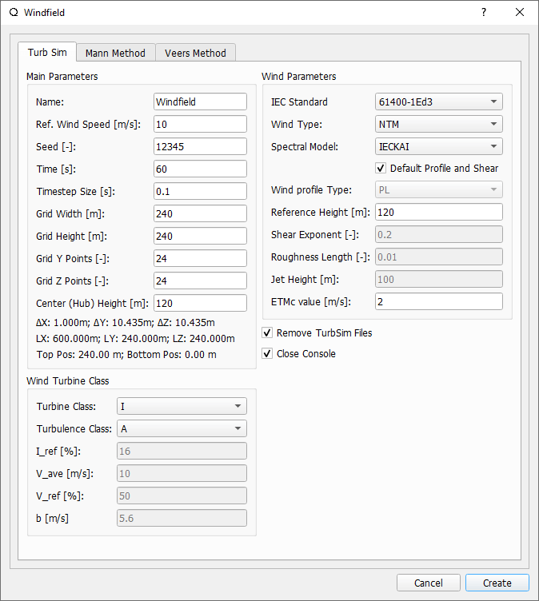
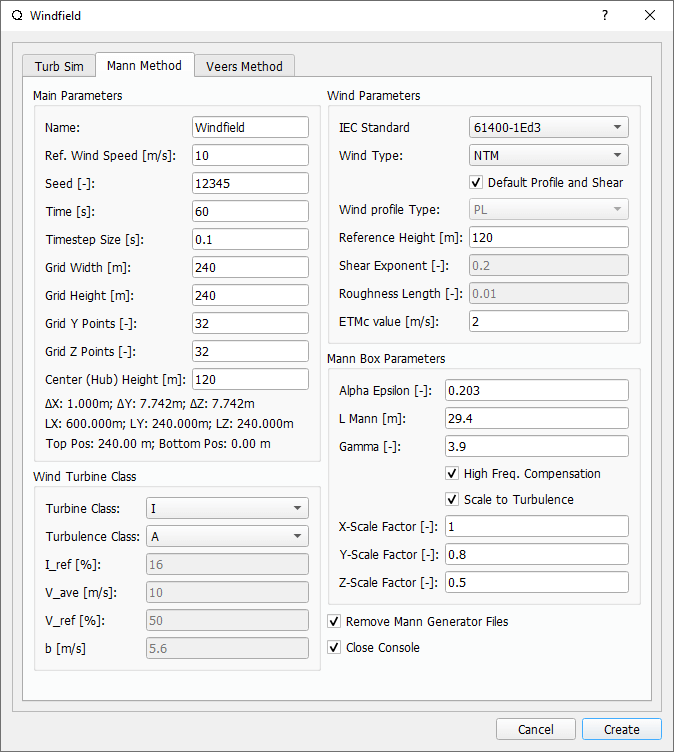
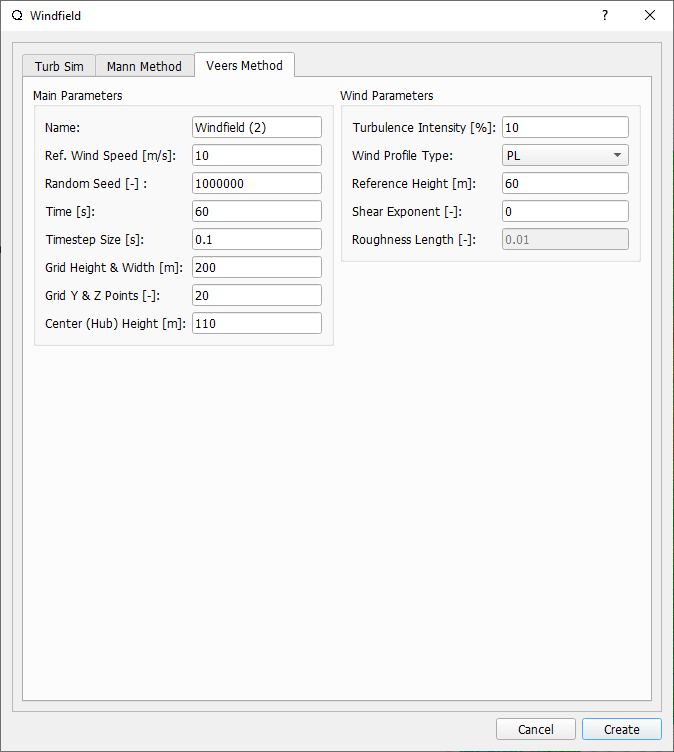
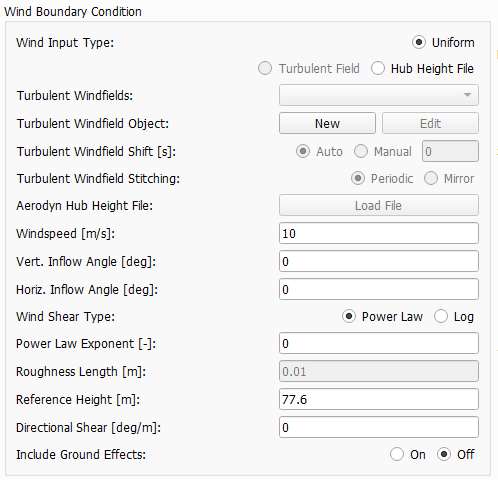

Wind Field Generator Overview
-----------------------------

.. _fig-wind-module:
.. figure:: windbutton.png
    :align: center
    :alt: Wind field creation dialogue in QBlade.

    The wind field creation symbol in the QBlade main tool bar. 

If a time domain simulation is being carried out, a wind field can be defined and added to the simulation.
This provides important information for the calculation of aerodynamic quantities. 
Three types of wind fields can be generated for use in QBlade. These are described individually below.

Turbulent Wind Field 
--------------------
The final type of wind file which can be set up is a three dimensional, fully turbulent wind field.
This can be either generated through the *Wind Input Type* button of the turbine simulation dialogue, as shown in :numref:`fig-wind-pane` or by directly generating this within the
turbulent wind module, shown in :numref:`fig-wind-module`. 

Three different options, to generate a three dimensional, fully turbulent wind field exist in QBlade.

* **TurbSim**: Generates the wind field uwing NREL's TurbSim binary (see B. J. Jonkman :footcite:`TurbSimGuide`).
* **Mann**: Generates the wind field using DTU`s Mann generator (see J. Mann :footcite:`mann1998`).
* **Veers**: Generates the wind field after the Veers algorithm (see P. S. Veers :footcite:`veers1988`).  

TurbSim Windfields
^^^^^^^^^^^^^^^^^^
	
When a new TurbSim wind fild is created, a range of parameters must be specified as shown by the wind field generator dialogue in :numref:`fig-turb-dia`.
After these have been selected, clicking on the *Create* button automatically passes the information to the TurbSim program :footcite:`TurbSimGuide`.
The TurnSim binary is automatically called by QBlade, and after creation the wind field is automatically imported, so that no additional user input is required.
The input parameters are described in detail in the following section. 

.. _fig-turb-dia:

    Turb sim windfield dialogue in QBlade.

**Main Parameters**

 These parameters dictate the spatial dimensions of the generated turbulent wind grid.
 A turbulent *box* is be generated which is then translated through the field of interest at the average velocity (defined below) 
 as is consistent with Taylor's hypothesis for a turbulent flow :footcite:`BatchelorBook`.
 
 * **Name**: The name of the wind field object.
 * **Ref. Wind Speed**: The reference wind speed of this wind field.
 * **Seed**: The random seed used to generate the wind field.
 * **Time**: Determines the length of the generated turbulent box.
 * **Timestep**: Specifies the discretisation in free stream (:math:`x`) direction.  
 * **Grid Width**: Specifies box size in lateral (:math:`y`) direction.
 * **Grid Height**: Specifies box size in vertical (:math:`z`) direction.
 * **Grid Y Points**: Specifies spatial discretisation in :math:`y` direction.
 * **Grid Z Points**: Specifies spatial discretisation in :math:`z` direction.
 * **Center (Hub) Height**: Specifies the vertical position of the box center.

**Turbine Class**

 These determine the turbine class as defined in the IEC 61400 design standard :footcite:`IEC61400-1`.
 
 * **Turbine Class**: Specifies the design turbine class.
 * **Turbulence Class**: Specifies the design turbulence class.
 * **I_ref**: Specifies the turbulence intensity.
 * **V_ref**: Specifies the reference velocity.
 * **b**: The *b* parameter, used to calculate the turbulence standard deviation in IEC 61400.

**Wind Parameters**

 These parameters specify the parameters and model inputs required for generation of the turbulent velocity field. 
 
 * **IEC Standard**: Specifies the version of the IEC standard, used to generate the wind field.
 * **Wind Type**: Specifies the wind field type of the generated wind field.
 * **Spectral Model**: Specifies the form of the spectral tensor applied to generate the stochastic velocity fluctuations.
 * **Wind Profile Type**: Specifies the model used to represent the atmospheric shear layer.
 * **Reference Height**: Specifies the reference height of the aforementioned shear layer model.
 * **Shear Exponent**: Specifies the shear exponent of the aforementioned shear layer model (if exponential model chosen).
 * **Roughness Length**: Specifies the reference height of the aforementioned shear layer model (if logarithmic model chosen).
 * **Jet Height**: Specifies the jet height of the aforementioned shear layer model (if jet model chosen).
 * **ETMC value**: Specifies the extreme turbulence model :math:`c` value (if ETM model chosen).
 * **Remove TurbSim Files**: If checked, the TurbSim files generated and subsequently read by QBlade, are automatically deleted.
 * **Close Console**: If checked, the console which is called to generate the TurbSim file is automatically closed upon completion of TurbSim file generation. 
    
Mann Windfields
^^^^^^^^^^^^^^^
	
When a new Mann wind fild is created, a range of parameters must be specified as shown by the wind field generator dialogue in :numref:`fig-mann-dia`.
After these have been selected, clicking on the *Create* button automatically passes the information to `DTU's Mann 64bit Turbulence Generator <https://www.hawc2.dk/install/standalone-mann-generator>`_.
The Mann binary is automatically called by QBlade, and after creation the wind field is automatically imported, so that no additional user input is required. **Please note** that the Mann 64bit generator currently is only available for Windows operating systems.
The input parameters are described in detail in the following section. 

.. _fig-mann-dia:

    Mann windfield dialogue in QBlade.

**Main Parameters**

 These parameters dictate the spatial dimensions of the generated turbulent wind grid.
 A turbulent *box* is be generated which is then translated through the field of interest at the average velocity (defined below) 
 as is consistent with Taylor's hypothesis for a turbulent flow :footcite:`BatchelorBook`.
 
 * **Name**: The name of the wind field object.
 * **Ref. Wind Speed**: The reference wind speed of this wind field.
 * **Seed**: The random seed used to generate the wind field.
 * **Time**: Determines the length of the generated turbulent box.
 * **Timestep**: Specifies the discretisation in free stream (:math:`x`) direction.  
 * **Grid Width**: Specifies box size in lateral (:math:`y`) direction.
 * **Grid Height**: Specifies box size in vertical (:math:`z`) direction.
 * **Grid Y Points**: Specifies spatial discretisation in :math:`y` direction (must be power of 2).
 * **Grid Z Points**: Specifies spatial discretisation in :math:`z` direction (must be power of 2).
 * **Center (Hub) Height**: Specifies the vertical position of the box center.

**Turbine Class**
 
 These determine the turbine class as defined in the IEC 61400 design standard :footcite:`IEC61400-1`.
 
 * **Turbine Class**: Specifies the design turbine class.
 * **Turbulence Class**: Specifies the design turbulence class.
 * **I_ref**: Specifies the turbulence intensity.
 * **V_ref**: Specifies the reference velocity.
 * **b**: The *b* parameter, used to calculate the turbulence standard deviation in IEC 61400.

**Wind Parameters**
 
 These parameters specify the parameters and model inputs required for generation of the turbulent velocity field. 
 
 * **IEC Standard**: Specifies the version of the IEC standard, used to generate the wind field.
 * **Wind Type**: Specifies the wind field type of the generated wind field.
 * **Spectral Model**: Specifies the form of the spectral tensor applied to generate the stochastic velocity fluctuations.
 * **Wind Profile Type**: Specifies the model used to represent the atmospheric shear layer.
 * **Reference Height**: Specifies the reference height of the aforementioned shear layer model.
 * **Shear Exponent**: Specifies the shear exponent of the aforementioned shear layer model (if exponential model chosen).
 * **Roughness Length**: Specifies the reference height of the aforementioned shear layer model (if logarithmic model chosen).
 * **ETMC value**: Specifies the extreme turbulence model :math:`c` value (if ETM model chosen).

**Mann Box Parameters**
 
 * **Alpha Epsilon**: The Mann model :math:`\alpha\epsilon^{\frac{2}{3}}` parameter.
 * **L Mann**: The Mann length scale parameter.
 * **Gamma**: The non-dimensional shear distortion parameter.     
 * **High Freq. Compensation**: If checked: applies the high frequency compensation, so that point velocities represent local anemometer measurements.
 * **Scale to Turbulence**: If checked: scales the Mann box turbulence to the defined IEC turbulence, multiplied by the parameters described below
 * **X-Scale Factor**: Scales the longitudinal turbulence along the x-axis to the IEC turbulence, mutiplied by this value.
 * **Y-Scale Factor**: Scales the transversal turbulence along the y-axis to the IEC turbulence, mutiplied by this value.
 * **Z-Scale Factor**: Scales the transversal turbulence along the z-axis to the IEC turbulence, mutiplied by this value.

Veers Windfields
^^^^^^^^^^^^^^^^
	
When a new Veers wind fild is created, a range of parameters must be specified as shown by the wind field generator dialogue in :numref:`fig-veers-dia`.
After these have been selected, clicking on the *Create* button automatically generates a wind field using the Veers method build into QBlade (see P. Veers :footcite:`veers1988`).
The input parameters are described in detail in the following section. 

.. _fig-veers-dia:

    Veers windfield dialogue in QBlade.

**Main Parameters**

 These parameters dictate the spatial dimensions of the generated turbulent wind grid.
 A turbulent *box* is be generated which is then translated through the field of interest at the average velocity (defined below) 
 as is consistent with Taylor's hypothesis for a turbulent flow :footcite:`BatchelorBook`.
 
 * **Name**: The name of the wind field object.
 * **Ref. Wind Speed**: The reference wind speed of this wind field.
 * **Seed**: The random seed used to generate the wind field.
 * **Time**: Determines the length of the generated turbulent box.
 * **Timestep**: Specifies the discretisation in free stream (:math:`x`) direction.  
 * **Grid Height & Width**: Specifies box size in horizontal (:math:`y`) and vertical (:math:`z`) direction.
 * **Grid Y & Z Points**: Specifies spatial discretisation in :math:`y` and :math:`z` direction 
 * **Center (Hub) Height**: Specifies the vertical position of the box center.

**Wind Parameters**

 These parameters specify the parameters and model inputs required for generation of the turbulent velocity field. 
 
 * **Turbulence Intensity**: The target turbulence intensity.
 * **Wind Profile Type**: Specifies the model used to represent the atmospheric shear layer.
 * **Reference Height**: Specifies the reference height of the aforementioned shear layer model.
 * **Shear Exponent**: Specifies the shear exponent of the aforementioned shear layer model (if exponential model chosen).
 * **Roughness Length**: Specifies the reference height of the aforementioned shear layer model (if logarithmic model chosen).   
 
Uniform Wind Field 
------------------
A uniform wind field is specified directly within the *Wind Input Type* of the turbine simulation dialogue, shown in :numref:`fig-wind-pane` (see :doc:`../simulation/simulation`).
The necessary input parameters including velocity, horizontal inflow angle and directional shear are defined here.
In the case that the atmospheric boundary layer is to be modelled, this can be selected with the wind shear type radio button. 
The corresponding shear parameters can then by specified (see :doc:`../../theory/environment/wind/wind`). 

.. _fig-wind-pane:

    Specification of a uniform wind field within the turbine simulation dialogue. 
	
Hub Height File
---------------
The user has more modelling freedom when a hub-height wind file is used. This type of file can either be created manually or by using the IEC wind tool :footcite:`IECwindtool`. This allows the specification of the velocity field at the hub height as a function of time. QBlade interpolates the time between the starting time of the file and the point where the predefined wind velocity profile (EOG in this case) should start. If the user specified simulation time exceeds the ending time in the hub-height file, QBlade will create a constant wind field with the parameters from the last entry of the hub-height file until the end of the simulation. An exemplary hubheight input file that described an extreme operating gust (EOG) at 20m/s is shown below:

.. code-block:: console

	Time	Wind	Horiz.	Vert.	LinH.	Vert.	LinV.	Gust
		Speed	Dir	Speed	Shear	Shear	Shear	Speed
	0.000	20.000	0.000	0.000	0.000	0.200	0.000	0.000	
	60.000	20.000	0.000	0.000	0.000	0.200	0.000	0.000	
	60.100	20.000	0.000	0.000	0.000	0.200	0.000	-0.000	
	60.200	20.000	0.000	0.000	0.000	0.200	0.000	-0.004	
	60.300	20.000	0.000	0.000	0.000	0.200	0.000	-0.012	
	60.400	20.000	0.000	0.000	0.000	0.200	0.000	-0.028	
	60.500	20.000	0.000	0.000	0.000	0.200	0.000	-0.054	
	60.600	20.000	0.000	0.000	0.000	0.200	0.000	-0.092	
	60.700	20.000	0.000	0.000	0.000	0.200	0.000	-0.144	
	60.800	20.000	0.000	0.000	0.000	0.200	0.000	-0.209	
	60.900	20.000	0.000	0.000	0.000	0.200	0.000	-0.289	
	61.000	20.000	0.000	0.000	0.000	0.200	0.000	-0.384	
	61.100	20.000	0.000	0.000	0.000	0.200	0.000	-0.493	
	61.200	20.000	0.000	0.000	0.000	0.200	0.000	-0.614	
	61.300	20.000	0.000	0.000	0.000	0.200	0.000	-0.747	
	61.400	20.000	0.000	0.000	0.000	0.200	0.000	-0.889	
	61.500	20.000	0.000	0.000	0.000	0.200	0.000	-1.037	
	61.600	20.000	0.000	0.000	0.000	0.200	0.000	-1.188	
	61.700	20.000	0.000	0.000	0.000	0.200	0.000	-1.338	
	61.800	20.000	0.000	0.000	0.000	0.200	0.000	-1.485	
	61.900	20.000	0.000	0.000	0.000	0.200	0.000	-1.622	
	62.000	20.000	0.000	0.000	0.000	0.200	0.000	-1.748	
	62.100	20.000	0.000	0.000	0.000	0.200	0.000	-1.856	
	62.200	20.000	0.000	0.000	0.000	0.200	0.000	-1.944	
	62.300	20.000	0.000	0.000	0.000	0.200	0.000	-2.007	
	62.400	20.000	0.000	0.000	0.000	0.200	0.000	-2.041	
	62.500	20.000	0.000	0.000	0.000	0.200	0.000	-2.043	
	62.600	20.000	0.000	0.000	0.000	0.200	0.000	-2.011	
	62.700	20.000	0.000	0.000	0.000	0.200	0.000	-1.942	
	62.800	20.000	0.000	0.000	0.000	0.200	0.000	-1.834	
	62.900	20.000	0.000	0.000	0.000	0.200	0.000	-1.686	
	63.000	20.000	0.000	0.000	0.000	0.200	0.000	-1.498	
	63.100	20.000	0.000	0.000	0.000	0.200	0.000	-1.271	
	63.200	20.000	0.000	0.000	0.000	0.200	0.000	-1.005	
	63.300	20.000	0.000	0.000	0.000	0.200	0.000	-0.703	
	63.400	20.000	0.000	0.000	0.000	0.200	0.000	-0.366	
	63.500	20.000	0.000	0.000	0.000	0.200	0.000	0.000	
	63.600	20.000	0.000	0.000	0.000	0.200	0.000	0.393	
	63.700	20.000	0.000	0.000	0.000	0.200	0.000	0.807	
	63.800	20.000	0.000	0.000	0.000	0.200	0.000	1.237	
	63.900	20.000	0.000	0.000	0.000	0.200	0.000	1.678	
	64.000	20.000	0.000	0.000	0.000	0.200	0.000	2.124	
	64.100	20.000	0.000	0.000	0.000	0.200	0.000	2.568	
	64.200	20.000	0.000	0.000	0.000	0.200	0.000	3.003	
	64.300	20.000	0.000	0.000	0.000	0.200	0.000	3.425	
	64.400	20.000	0.000	0.000	0.000	0.200	0.000	3.825	
	64.500	20.000	0.000	0.000	0.000	0.200	0.000	4.198	
	64.600	20.000	0.000	0.000	0.000	0.200	0.000	4.539	
	64.700	20.000	0.000	0.000	0.000	0.200	0.000	4.841	
	64.800	20.000	0.000	0.000	0.000	0.200	0.000	5.101	
	64.900	20.000	0.000	0.000	0.000	0.200	0.000	5.314	
	65.000	20.000	0.000	0.000	0.000	0.200	0.000	5.477	
	65.100	20.000	0.000	0.000	0.000	0.200	0.000	5.587	
	65.200	20.000	0.000	0.000	0.000	0.200	0.000	5.642	
	65.300	20.000	0.000	0.000	0.000	0.200	0.000	5.642	
	65.400	20.000	0.000	0.000	0.000	0.200	0.000	5.587	
	65.500	20.000	0.000	0.000	0.000	0.200	0.000	5.477	
	65.600	20.000	0.000	0.000	0.000	0.200	0.000	5.314	
	65.700	20.000	0.000	0.000	0.000	0.200	0.000	5.101	
	65.800	20.000	0.000	0.000	0.000	0.200	0.000	4.841	
	65.900	20.000	0.000	0.000	0.000	0.200	0.000	4.539	
	66.000	20.000	0.000	0.000	0.000	0.200	0.000	4.198	
	66.100	20.000	0.000	0.000	0.000	0.200	0.000	3.825	
	66.200	20.000	0.000	0.000	0.000	0.200	0.000	3.425	
	66.300	20.000	0.000	0.000	0.000	0.200	0.000	3.003	
	66.400	20.000	0.000	0.000	0.000	0.200	0.000	2.568	
	66.500	20.000	0.000	0.000	0.000	0.200	0.000	2.124	
	66.600	20.000	0.000	0.000	0.000	0.200	0.000	1.678	
	66.700	20.000	0.000	0.000	0.000	0.200	0.000	1.237	
	66.800	20.000	0.000	0.000	0.000	0.200	0.000	0.807	
	66.900	20.000	0.000	0.000	0.000	0.200	0.000	0.393	
	67.000	20.000	0.000	0.000	0.000	0.200	0.000	0.000	
	67.100	20.000	0.000	0.000	0.000	0.200	0.000	-0.366	
	67.200	20.000	0.000	0.000	0.000	0.200	0.000	-0.703	
	67.300	20.000	0.000	0.000	0.000	0.200	0.000	-1.005	
	67.400	20.000	0.000	0.000	0.000	0.200	0.000	-1.271	
	67.500	20.000	0.000	0.000	0.000	0.200	0.000	-1.498	
	67.600	20.000	0.000	0.000	0.000	0.200	0.000	-1.686	
	67.700	20.000	0.000	0.000	0.000	0.200	0.000	-1.834	
	67.800	20.000	0.000	0.000	0.000	0.200	0.000	-1.942	
	67.900	20.000	0.000	0.000	0.000	0.200	0.000	-2.011	
	68.000	20.000	0.000	0.000	0.000	0.200	0.000	-2.043	
	68.100	20.000	0.000	0.000	0.000	0.200	0.000	-2.041	
	68.200	20.000	0.000	0.000	0.000	0.200	0.000	-2.007	
	68.300	20.000	0.000	0.000	0.000	0.200	0.000	-1.944	
	68.400	20.000	0.000	0.000	0.000	0.200	0.000	-1.856	
	68.500	20.000	0.000	0.000	0.000	0.200	0.000	-1.748	
	68.600	20.000	0.000	0.000	0.000	0.200	0.000	-1.622	
	68.700	20.000	0.000	0.000	0.000	0.200	0.000	-1.485	
	68.800	20.000	0.000	0.000	0.000	0.200	0.000	-1.338	
	68.900	20.000	0.000	0.000	0.000	0.200	0.000	-1.188	
	69.000	20.000	0.000	0.000	0.000	0.200	0.000	-1.037	
	69.100	20.000	0.000	0.000	0.000	0.200	0.000	-0.889	
	69.200	20.000	0.000	0.000	0.000	0.200	0.000	-0.747	
	69.300	20.000	0.000	0.000	0.000	0.200	0.000	-0.614	
	69.400	20.000	0.000	0.000	0.000	0.200	0.000	-0.493	
	69.500	20.000	0.000	0.000	0.000	0.200	0.000	-0.384	
	69.600	20.000	0.000	0.000	0.000	0.200	0.000	-0.289	
	69.700	20.000	0.000	0.000	0.000	0.200	0.000	-0.209	
	69.800	20.000	0.000	0.000	0.000	0.200	0.000	-0.144	
	69.900	20.000	0.000	0.000	0.000	0.200	0.000	-0.092	
	70.000	20.000	0.000	0.000	0.000	0.200	0.000	-0.054	
	70.100	20.000	0.000	0.000	0.000	0.200	0.000	-0.028	
	70.200	20.000	0.000	0.000	0.000	0.200	0.000	-0.012	
	70.300	20.000	0.000	0.000	0.000	0.200	0.000	-0.004	
	70.400	20.000	0.000	0.000	0.000	0.200	0.000	-0.000	
	70.500	20.000	0.000	0.000	0.000	0.200	0.000	0.000	

.. footbibliography::
