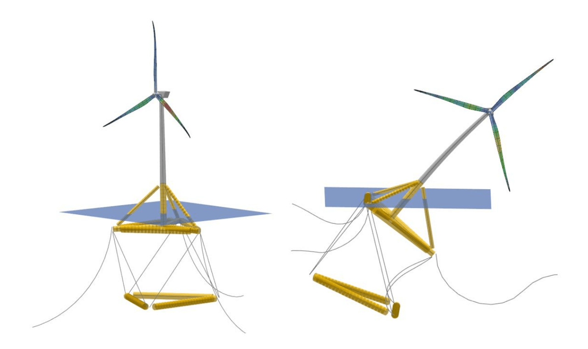

Validation and Examples of Hydroelasticity
==========================================

In this page, examples of hydroelastic simulations and validations with multiple substructure geometries are presented.

.. _OC4_ME_Hydroelastic_Example:

OC4 Semisubmersible ME Hydroelastic Model 
------------------------------------------

The :ref:`OC4_ME_Model_Results` validated in :doc:`../me/me` can also be modeled with fully elastic members. 
The elastic members, together with the full Morison equation (see :doc:`../../../theory/hydrodynamics/me/me`) at each element allow us to 
have fully hydroelastic simulations within QB. The structural properties of the individual elements were taken from :footcite:`HAWC2OC4Model`.

.. _fig-OC4ME-Modes:
.. figure:: OC4_Modes.PNG
    :align: center
    :alt: OC4 Model Modes

    Two exemplary modes of the flexible OC4 ME model.

:numref:`fig-OC4ME-Modes` show two exemplary eigenmodes of the OC4 ME flexible model. Mode 15 on the left side has
frequency 0.249 Hz and shows a combination of blade, tower and substructure deflections. For the
substructure, it is mainly the cross-braces that are deflecting. Mode 404 on the right side of :numref:`fig-OC4ME-Modes` has
a frequency of 20.031 Hz. This mode shows a deflection of the three base and upper columns relative to
each other. We note that there
is also a tower deflection taking place in this mode. The high frequency of Mode 404 is also an argument
for simulating the OC4 substructure as a rigid body if the local forces on the substructure are not required.
The excitation frequencies from wind and waves are significantly lower than the eigenfrequencies of these
modes. We also note that both modes shown in :numref:`fig-OC4ME-Modes` also include the deflection of the mooring
cables. All flexible members are taken into account when performing the eigenmode analysis within QB.

The flexible OC4 ME model was simulated in a regular
sea state with :math:`H` = 6 m and :math:`T` = 10 s. No aerodynamic loads were applied on the turbine and the
wave direction was chosen to coincide with the positive surge direction. The local loads for two locations
were recorded: the lowest position of the main column and the connection point of the cross brace 1 with
the upper column 1 (see :numref:`fig-OC4ME-LoadSensors`).

.. _fig-OC4ME-LoadSensors:

    Load sensor locations for flexible OC4 ME calculations.

:numref:`fig-OC4ME-Loads` shows the local forces at the main column and the cross brace for the initial 400 s of the regular
sea state simulation. We can see that the forces behave as expected. The source of the local forces at the
main column bottom location arise mainly from the hydrodynamic and gravitational loads. The local force
in the x-direction (surge) has an oscillatory behavior around 0 kNm, which can be explained by the
oscillatory nature of the hydrodynamic wave loads in surge direction. This also explains the small forces
in the y-direction (sway) since no wave loads are acting in this direction. Finally, in z-direction (heave), the
oscillatory wave loads have a non-zero mean value. This comes from the gravitational loads acting in the
z-direction. These localized loads can be used to design the individual components of a floating wind
turbine substructure.

.. _fig-OC4ME-Loads:

    Local forces at two locations of the OC4 ME flexible substructure.

:numref:`fig-OC4ME-Defs` shows the corresponding local deflections of the main column and cross brace. We can see in
this figure that the substructure deflections at these positions are very small, not even reaching 1 mm.
This comes from the large stiff structures that make up the OC4 substructure. :numref:`fig-OC4ME-Defs` shows that the
rigid substructure assumption made for this model is a valid. 

.. _fig-OC4ME-Defs:

    Local deflections at two locations of the OC4 ME flexible substructure.

.. _10MW_Tetraspar_Hydroelastic_Example:

10 MW TetraSpar Hydroelastic Model 
-----------------------------------

In :numref:`fig-10MW-TetraSpar`, we show a hydroelastic model of a 10 MW turbine mounted on an up-scaled
TetraSpar substructure :footcite:`Borg2020TetraSpar`. The modelling of this substructure is particularly challenging because it
features a flexible suspension between the upper floater structure and the lower keel. Within QB, this
suspension system can be modelled as a cable element similar to the mooring system (Section XXX). The
TetraSpar model shown in :numref:`fig-10MW-TetraSpar` is composed of flexible Morison elements and we are therefore
capable of accurately calculating the local loading on each element even when the substructure model is
highly deflected. An example of this is shown on the right hand side of :numref:`fig-10MW-TetraSpar`. This extreme roll position
is unlikely to happen in reality, but being able to simulate such conditions in QB is a good example of the
modelling capabilities of the tool.

.. _fig-10MW-TetraSpar:

    Hydroelastic model of a 10MW turbine on an up-scaled TetraSpar substructure.

.. footbibliography::
