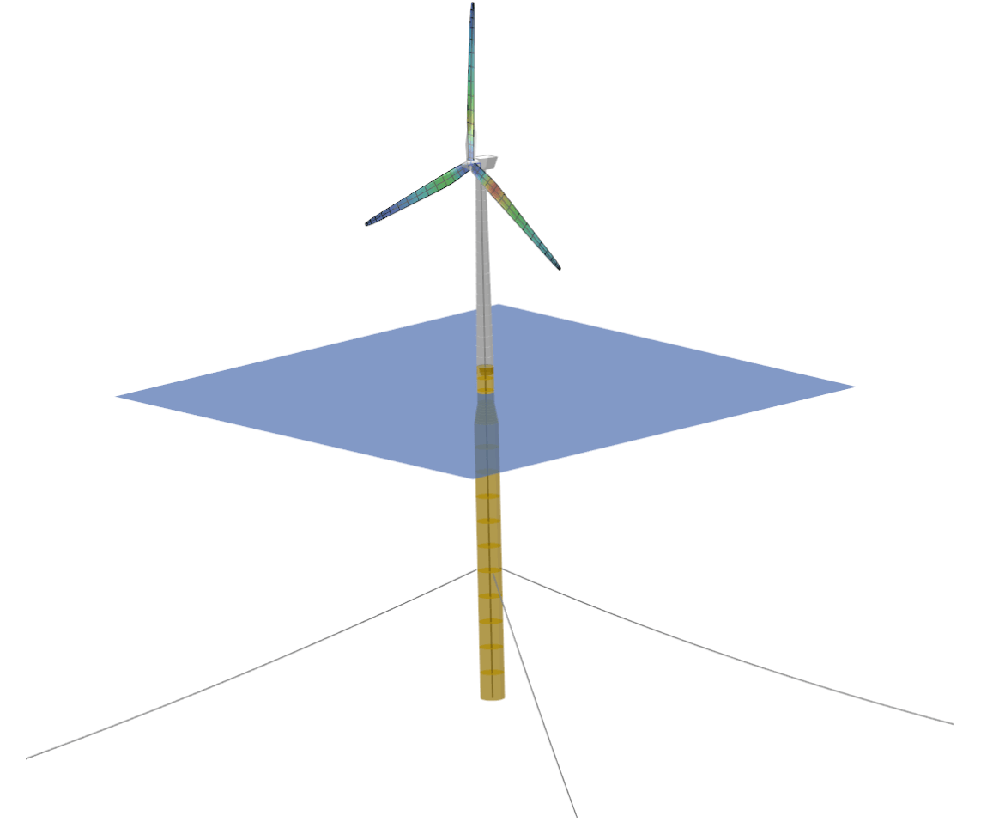
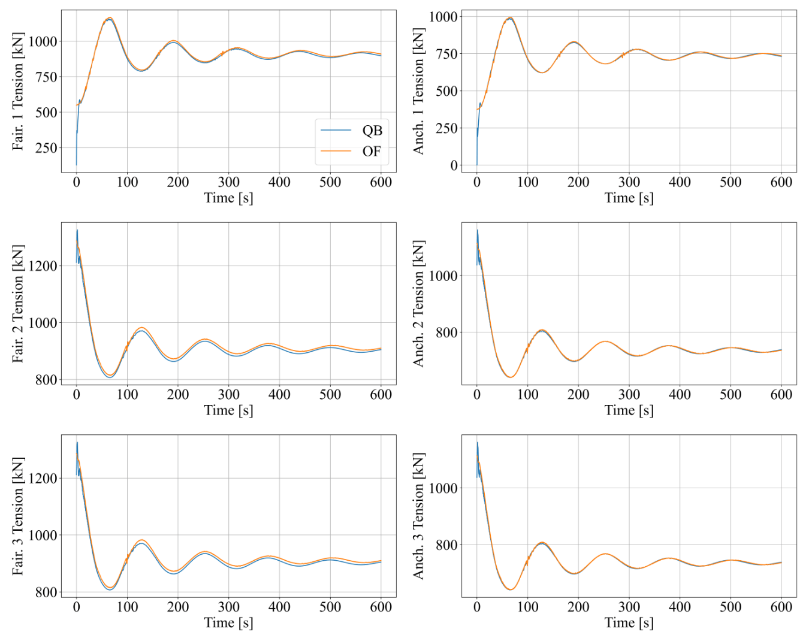
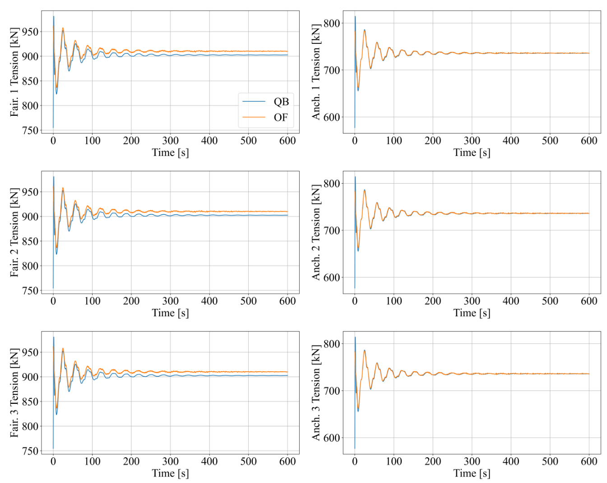
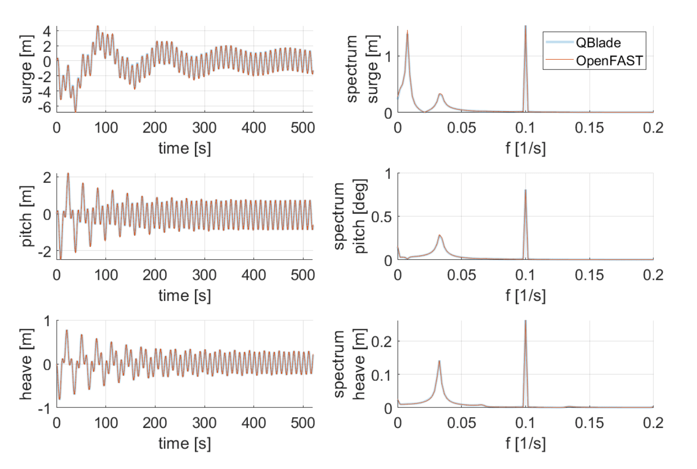
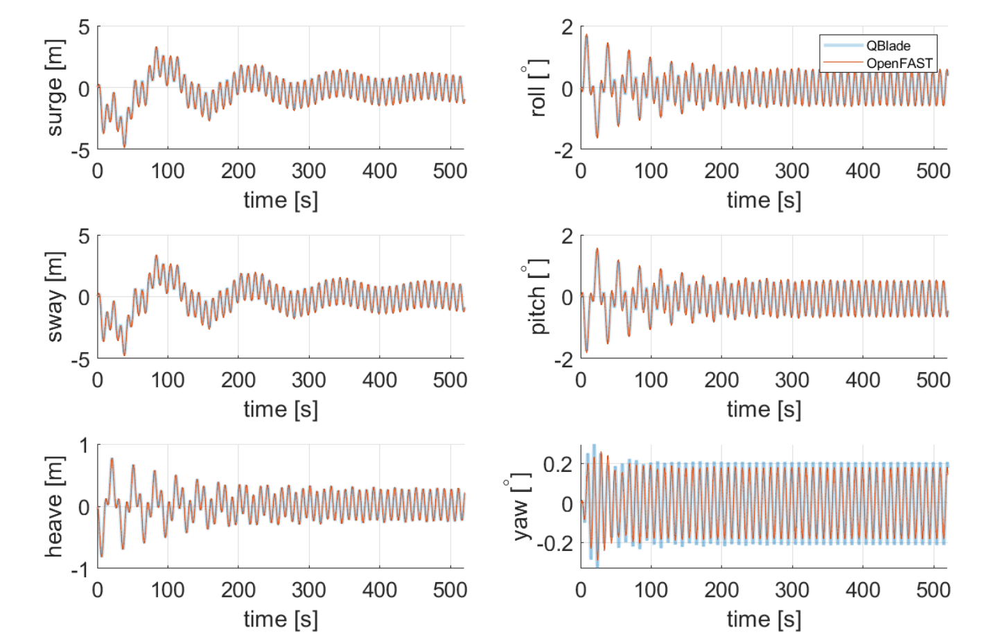
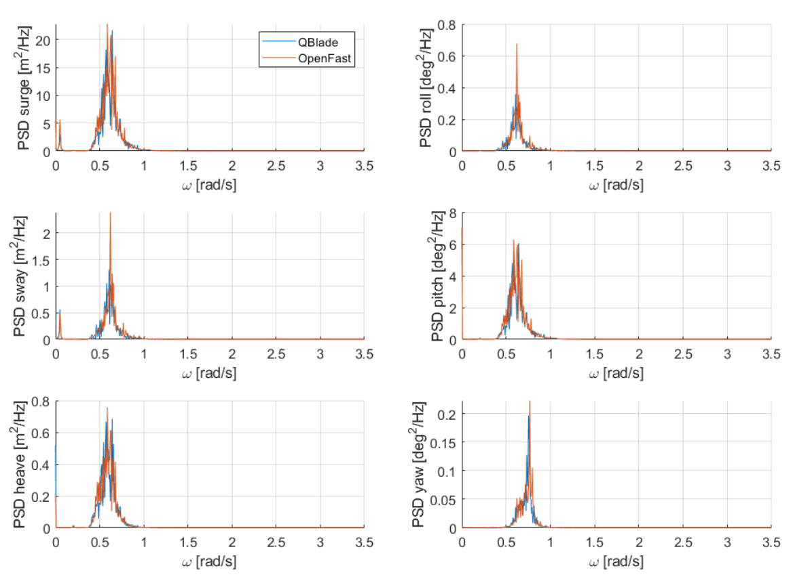
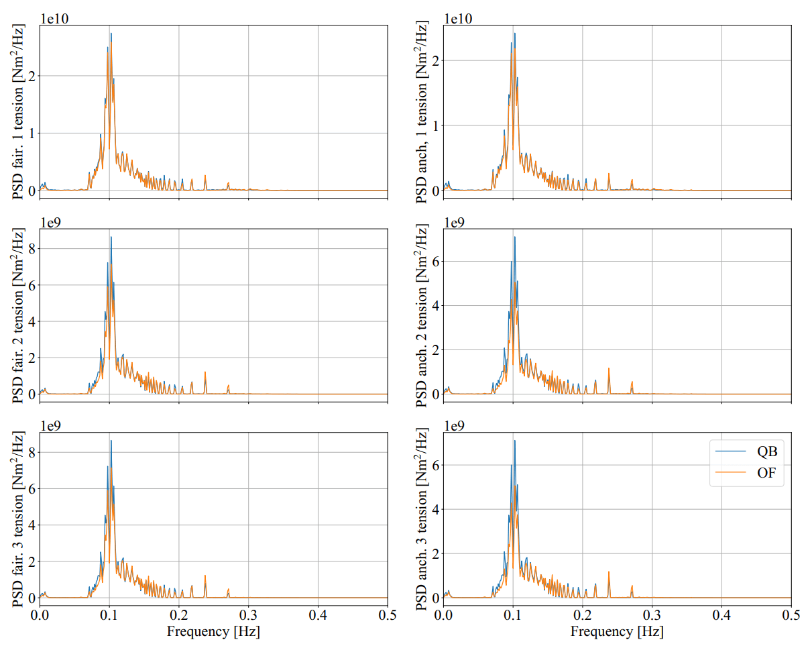
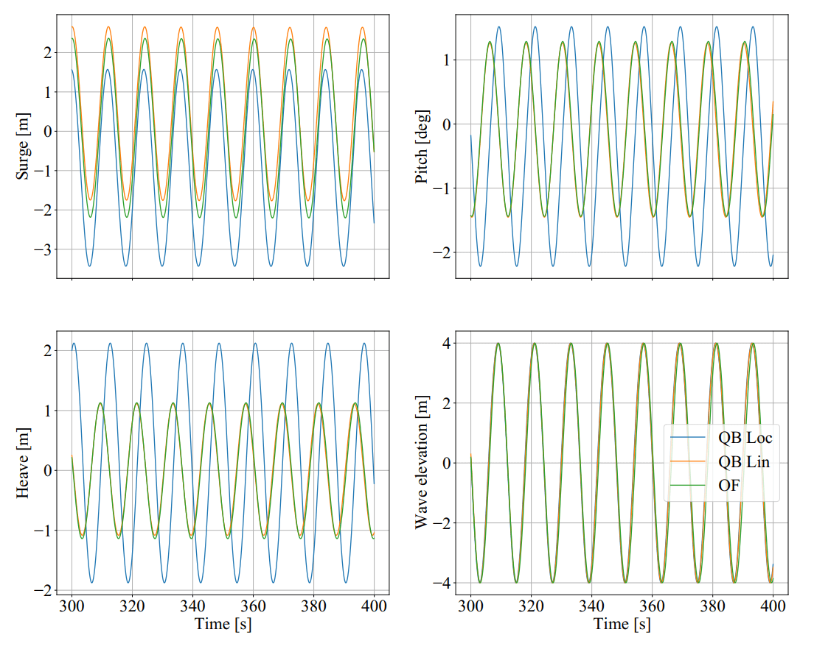
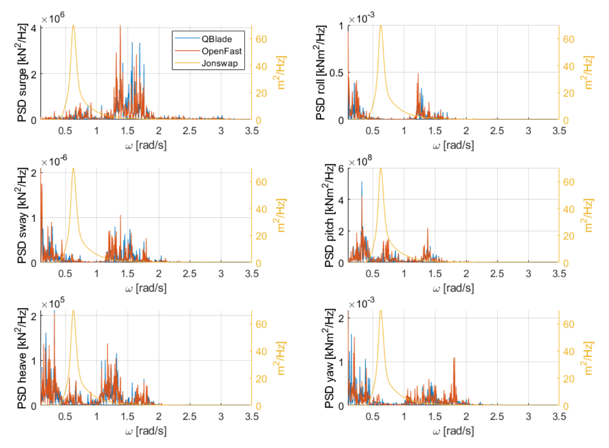

Validation Tests for Potential Flow Models with Morison Drag (LPMD)
====================================================================
The linear potential flow model in QBlade (QB) (see :doc:`../../../theory/hydrodynamics/lpft/lpft`) was validated in a series of test load cases using two different turbine models: a spar buoy and a semisubmersible.
The linear potential flow model was enhanced with quadratic drag forces via the Morison equation (see :doc:`../../../theory/hydrodynamics/me/me`) and is termed LPMD in this document.
The load cases were chosen with increasing complexity to make sure the individual modules were working correctly. 

The results were validated against the open-source aero-hydro-elastic code OpenFAST (OF) :footcite:`OpenFAST` (version 2.5.0). 
The same turbine models and test cases were setup and used in QB and OF. Not all of the hydroelastic modelling capabilities of QB are present in OF. 
When validating certain hydrodynamic models, the hydrodynamic capabilities of QB were adapted to reflect those of OF to have a better comparison.
These modifications are mentioned in the appropriate load cases below.

In the following sections, the results for each model are presented.

OC3 Spar Buoy LPMD Model
-------------------------
The first model, named OC3 model in this document, is the floating 5 MW wind turbine mounted on a spar buoy from the OC3 Report :footcite:`OC3_Model`. This
model was considered so that we have a simple geometry to test the different hydrodynamic models. :numref:`fig-OC3-QB` shows the OC3 LMPD model within the QB GUI. The substructure was considered rigid in this
model to evaluate only the hydrodynamic modules. For this model, the mooring system was modeled explicitly and the localized buoyancy model was used.

.. _fig-OC3-QB:

    The OC3 model displayed in the QB GUI featuring a spar buoy substructure.

OC3 LPMD No Wave Tests
^^^^^^^^^^^^^^^^^^^^^^^
The no wave tests are split into two parts, the first and main part consists in free decay tests in still water. The second part considers the turbine reaction to no wave and constant current conditions. We will
describe first the results from the decay tests and later present the results for the constant current tests. 

OC3 LPMD Free Decay Tests
""""""""""""""""""""""""""

The free decay tests simulate the turbine model in free decay from an initial position in still water condition. No aerodynamic loads were considered in the decay tests. All the 6 degrees of freedom (DOFs)
are considered for in the decay tests. The evaluation of the results is done 1) visually, by inspecting the time series of all isochronic DOFs and 2) quantitatively, by analyzing the eigenfrequency and damping of
the disturbed DOF. The latter analysis was done according to the procedure presented in :footcite:`OC5_Model`. 

:numref:`fig-OC3-Decay-Surge` to :numref:`fig-OC3-Decay-Pitch` show the time series for the decay tests of the surge, heave and pitch DOFs. From these figures we can see that the predictions from QB and OF are practically identical. This is not only the
case for the initially disturbed DOF but for the other DOFs as well. In the surge and pitch decay tests, there is a small offset between the heave time series. This offset comes from the different way the buoyancy is
calculated between OF and QB. In OF, the buoyancy is accounted for by linearized stiffness matrices. In QB, the buoyancy forces is taken are calculated explicitly by taking into account the locally displaced water
volume.

.. _fig-OC3-Decay-Surge:

    Time series of the OC3 surge decay test.

.. _fig-OC3-Decay-Heave:

    Time series of the OC3 heave decay test.

.. _fig-OC3-Decay-Pitch:

    Time series of the OC3 pitch decay test.

The decay tests for the other three DOFs (sway, roll, yaw) were also simulated. The time series are not included in this document since the findings are very similar.

:numref:`fig-OC3-Decay-Surge-Mooring` to :numref:`fig-OC3-Decay-Pitch-Mooring` show the corresponding tensions at the fairlead and anchor locations of the mooring systems for the surge, heave and pitch decay tests. We can see good agreement between both codes.
Again, for the heave decay tests, there is a small offset in the tensions between the QB and OF simulations. It can be explained by the small offset in the heave neutral position between both codes and the different
approaches used in both codes to model the mooring system.

.. _fig-OC3-Decay-Surge-Mooring:

    Mooring line tensions for the OC3 surge decay test.

.. _fig-OC3-Decay-Heave-Mooring:

    Mooring line tensions for the OC3 heave decay test.

.. _fig-OC3-Decay-Pitch-Mooring:

    Mooring line tensions for the OC3 pitch decay test.

The decay tests were also analyzed quantitatively by comparing the eigenfrequencies and damping characteristics of the floater for the initially displaced DOFs. 
:numref:`fig-OC3-FreqsDamps` shows the results for the six performed decay tests. We can see in this figure that the normalized eigenfrequencies agree very well between both codes. 
There are significant differences in the damping characteristics, especially for the surge, sway, heave and yaw DOF.

.. _fig-OC3-FreqsDamps:

    Normalized eigenfrequencies and damping behaviour of the OC3 model for the considered decay tests.

The differences are assumed to come from the different mooring system models. OF uses MoorDyn, which uses a lumped-mass formulation for modelling axial elasticity :footcite:`MoorDyn`. 
QB uses a cable structural formulation (see :doc:`../../../theory/structure/chrono/chrono`) coupled with the Morison equation (see :doc:`../../../theory/hydrodynamics/me/me`) to account for the hydrodynamic forces on the mooring system. 
In order to test if the mooring system formulation causes the different damping behavior, we replaced the mooring system models with linear stiffness matrices in both codes. 
Since there is a significant linear damping term in the hydrodynamic matrices in the surge, sway, heave and yaw DOFs, a linear damping relation was assumed for the evaluation of the time series. 

:numref:`fig-OC3-FreqsDamps-LinMoor` shows the normalized eigenfrequencies and linear damping characteristics for the models with linearized
mooring systems. We can see now that the values for all DOFs except the yaw DOF align. For this turbine model the yaw DOF does not couple with the other DOFs and 
is almost exclusively determined by the stiffness, damping and inertia matrices, since the quadratic damping term of the Morison equation is not applied to
cylinder rotations. So the decay behavior can be calculated analytically. Using the stiffness, inertia and damping values and adding the rotational inertia of the turbine, 
an analytic eigenfrequency of 0.118 Hz was determined. This value is only 3% off from the values gotten in the QB and OF calculations. The analytical damping ratio is 4.4%. 
This value differs from the one obtained in QB simulations by 0.5% and from the one by OF simulations by 17%. It is therefore assumed that the value obtained by QB
simulations is the correct one.

.. _fig-OC3-FreqsDamps-LinMoor:

    Normalized eigenfrequencies and damping behaviour of the OC3 model with linear mooring for the considered decay tests.

OC3 LPMD Current-Only Tests
""""""""""""""""""""""""""""

The second part of the no wave tests comprised constant current tests. For these tests, two current
profiles were selected according to :footcite:`DNV-RP-C205`: a power-law profile – representing a tidal current velocity – and a
linear profile – representing a wind-generated current (see :doc:`../../../theory/environment/sea/currents`). The current direction is aligned with the positive
surge direction. The turbine was initially in its original undisplaced position and the simulations included
the transient response to the current profiles. No aerodynamic loads were applied in this case.

:numref:`fig-OC3-Current-Case` shows the time series of the wind-generated current test with a surface current magnitude of 3
m/s and decrease rate of 0.2 1/s. We can observe in this figure that the turbine behaves almost identically for the affected
DOFs (surge and pitch) when simulated with QB and OF. The different behavior in the heave DOF can be
attributed to the different ways the buoyancy is modelled in QB and OF. The right column plots of Figure
25 show the water particle velocities at three different locations along the turbine substructure: at 0 m,
at -10 m and at -20 m. We can see that the water velocities do not fully match. The reason for this is
twofold. Firstly, the water particle velocities from QB are shown in the moving coordinate system of the
substructure while in OF a fixed set of positions is used for the water particle velocity output. Secondly,
OF interpolates the water particle velocities to the output nodes while QB shows the velocities for the
center of the member that is closest to the selected output location. In the case of :numref:`fig-OC3-Current-Case`, the center
member location and the velocity output location was slightly different.

.. _fig-OC3-Current-Case:

    Displacements and water velocities for the OC3 model in a wind-generated current test case.

OC3 LPMD Regular Wave Cases
^^^^^^^^^^^^^^^^^^^^^^^^^^^^
The regular wave cases aim to validate the implementation of the first-order wave excitation forces in
QB. This done in load cases where a single wave train with varying amplitude, period and direction is used
to model the sea state. In order single out the effect of the excitation force
implementation, the respective models in both simulation tools are set up to be as similar as possible.
Therefore, the mooring system and the buoyancy are modeled with a linearized stiffness matrix. Both
tools make use of the same excitation force impulse response function (IRF) computed in WAMIT :footcite:`WAMIT`. 
No wave stretching model was used in QB so that the modelling considerations between QB and OF were as close as possible (see :doc:`../../../theory/environment/sea/kinematic_stretching`). OF does
currently not allow wave stretching models to be implemented in HydroDyn :footcite:`HydroDyn`. 
Similar to the free decay tests, no aerodynamic loads were considered. The validation is done by analyzing
the time series and frequency spectra of the excited OC3 model.

:numref:`fig-OC3-RegWave-Case1` and :numref:`fig-OC3-RegWave-Case4` show the time series and corresponding spectra of the three DOFs (surge, heave,
pitch) excited by an incoming wave from 0° direction for two regular wave cases. The first case has a wave height of 6 m and a 
period of 10 s and the second case has a wave height of 8 m and a period of 12 s. In both cases, an
initial transient is present and completely dies out after approximately 300s. This explains the
additional peaks at lower frequencies than the wave frequency in the respective spectral plots. Afterwards, a constant frequency 
excitation by the linear wave is present in all DOFs. It can be noted that the translations and rotations of the
floater are predicted in an identical manner between both tools. Hence, a correct implementation of the
first-order wave excitation loads may be concluded. It can be further noted that changing the wave height
and period does not induce any differences between both tools.

.. _fig-OC3-RegWave-Case1:

    Time series (left column) and corresponding spectra (right) of relevant DOFs for regular waves with a wave height of 6 m and a period of 10 s (0° incoming angle).

.. _fig-OC3-RegWave-Case4:

    Time series (left column) and corresponding spectra (right) of relevant DOFs for regular waves with a wave height of 8 m and a period of 12 s (0° incoming angle).

The next feature requiring validation is the influence of waves that approach the floater with an oblique angle.
The excitation input file provides IRFs with a degree spacing of 10 degrees (-180°:10°:180°). Thus, a wave
that heads in from an intermediate angle requires interpolation of the IRF. In order to validate this, :numref:`fig-OC3-RegWave-Case1-45deg`
shows the time series of all DOFs for a regular wave with a wave height of 6 m, a period of 10 s and a wave angle of 45 degrees. 
Once again both tools show very good agreement in the floater response. Very slight differences in the yaw DOF might be attributed to
differences in the interpolation algorithms.

.. _fig-OC3-RegWave-Case1-45deg:

    Time series of all DOFs for regular waves with a wave height of 6 m and a period of 10 s (45° incoming angle).

OC3 LPMD Irregular Wave Cases
^^^^^^^^^^^^^^^^^^^^^^^^^^^^^^

The validation of the first-order excitation loads in irregular waves was performed in a similar fashion to
the regular wave cases. Accordingly, the mooring system and buoyancy are modelled via linearized
matrices. The IRFs were precomputed in WAMIT and are identical to the ones used in OF. At this point it
is worth mentioning that the algorithmic approach doesn’t change within the hydrodynamic model of QB
for an irregular wave field compared to a wave field consisting of a single wave train. The reason is, that
the excitation loads are computed for every single wave train and superposed linearly (see :doc:`../../../theory/environment/sea/linear_waves`).
Two separated cases are analyzed. Firstly, an irregular wave field based on a JONSWAP
spectrum with uni-directional waves is considered. Secondly, a directional spread of the wave trains is
added in order to further validate the direction-dependent calculation of the wave loads. To increase the
statistical validity of the results, six runs were carried out for each simulated case. The significant wave
height amounts to :math:`H_s` = 6 m and the peak spectral period to :math:`T_p` = 10 s. 
A peak enhancement factor of :math:`\gamma` = 3.3 was chosen. The floater response in all 6 DOFs will serve as the validation parameter. Finally, statistical
parameters of the floater response and the tower base loads will be presented.

.. _fig-OC3-IrregWave-Waves:

    Averaged JONSWAP spectrum with :math:`H_s` = 6 m, :math:`T_p` = 10 s and :math:`\gamma` = 3.3.

:numref:`fig-OC3-IrregWave-Waves` shows the averaged wave fields that serve as an input to the calculation of the wave forces. 
In :numref:`fig-OC3-IrregWave-DOFs` the floater response for an irregular wave field with uni-directional waves is presented. The
three excited DOFs (surge, heave, pitch) show good accordance between QB and OF. The results are
averaged over the last 250 s of the aforementioned six runs, each with 800 s total duration. The peak at
the floater eigenfrequency arises due to not completely damped out initial transients. 

.. _fig-OC3-IrregWave-DOFs:

    Averaged PSDs of the floater translations and rotations in uni-directional, irregular waves.

:numref:`fig-OC3-IrregWave-DOFs-Mul` shows
the PSDs of the floater response for multi-directional waves in all 6 DOF s. To reduce the influence of the
initial transient, the total simulation length was set to 1200s. Again. The PSDs are averaged over the last
300s of six different simulations.

.. _fig-OC3-IrregWave-DOFs-Mul:

    Averaged PSDs of the floater translations and rotations in multi-directional, irregular waves.

:numref:`fig-OC3-IrregWave-stats-Mul` shows the time average, the standard deviation as well as minima and maxima of the floater
response in the 6 DOFs of both tools. Small deviations between the codes are visible but in general a
similar behavior is visible once again. An exact matching between these statistical parameters may not be
expected as they depend on the occurrence of severe wave groups. A longer simulation time would
presumably increase the agreement between the compared codes.

.. _fig-OC3-IrregWave-stats-Mul:

    Comparison of mean, standard deviation and extreme values of all 6 DOFs for multi-direction irregular waves     

OC3 LPMD Irregular Waves with Current
""""""""""""""""""""""""""""""""""""""

For the irregular wave test cases, a combination of wave and currents was also considered. For this case, a
JONSWAP spectrum with a significant wave height of :math:`H_s` = 6 m, a peak spectral period of :math:`T_p` = 10 s and a
value of :math:`\gamma` = 3.3 was again chosen. This wave spectrum was combined with a constant tide-induced current with
a power law of 1/7th and a surface current value of 0.5 m/s. The wave and current directions aligned with
the positive surge direction. Six repetitions were considered to account for the statistical variance of
irregular waves. In this test case, the same wave elevation input was used for OF and QB simulations.
Again, no aerodynamic loads were applied on the turbine. The mooring systems were modelled explicitly.

We can see in :numref:`fig-OC3-IrrWavCur-DOFs` the averaged PSDs of the six repetitions for all DOFs for both simulations. The
figure shows that the substructure dynamics for the relevant DOFs under irregular sea states and constant
currents is virtually identical if simulated with OF or QB.

.. _fig-OC3-IrrWavCur-DOFs:

    Averaged PSDs of all DOFs afor irregular wave and current simulations     

:numref:`fig-OC3-IrrWavCur-Mooring` shows the averaged PSD of the corresponding tensions at the fairlead and anchor positions for
the irregular wave plus current cases. We can see in this figure that there is a larger variation of the
fairlead and anchor tensions for the downwind mooring lines (lines 2 and 3). This difference can be attributed to the different mooring system
modelling that is present in QB and OF.

.. _fig-OC3-IrrWavCur-Mooring:

    Averaged PSDs of the fairlead and anchor tension for the irregular wave tests with constant current     

OC4 Semisubmersible LPMD Model
------------------------------

The second model considered in this validation -- named OC4 model in this document -- is the floating 5 MW wind
turbine mounted on a semisubmersible substructure from the OC4 Report :footcite:`OC4_Model`.
The geometry of the OC4 model within the QB GUI is shown in :numref:`fig-OC4-QB`. This figure shows clearly the
more complicated geometry of the turbine model. Hence, the hydrodynamic behavior of this model is
expected to be more complicated. The substructure was again considered rigid in this model to evaluate
only the hydrodynamic modules in this more challenging geometry. Unless otherwise stated, the mooring
system was modeled explicitly and the localized buoyancy model was used for this model.

.. _fig-OC4-QB:
.. figure:: OC4_Model_QB.PNG
    :align: center
    :alt: OC4 Model in QB GUI

    The OC4 model displayed in the QB GUI featuring a semisubmersible substructure.

.. _OC4LPMD_FreeDecay:

OC4 LPMD Free Decay Tests
^^^^^^^^^^^^^^^^^^^^^^^^^^^

For this model, decay tests were again performed in still water for four DOFs and compared to the same
simulations performed with OF. Again, the main difference between both codes in these tests were the
mooring system modelling and the way the buoyancy was calculated.

:numref:`fig-OC4-Decay-Surge` to :numref:`fig-OC4-Decay-Yaw` show the free decay tests for the surge, pitch and yaw DOF. We can see again that
the results for QB and OF are very similar. Especially for the disturbed DOFs and the DOF that are directly
coupled to them, the differences between both codes are small. We note again a small difference in the
mean of the heave position. This comes from the different buoyancy models used in QB and OF.

.. _fig-OC4-Decay-Surge:

    Time series of the OC4 model surge decay test.

.. _fig-OC4-Decay-Pitch:

    Time series of the OC4 model pitch decay test.

.. _fig-OC4-Decay-Yaw:

    Time series of the OC4 model yaw decay test.

:numref:`fig-OC4-Decay-Surge-Mooring` shows the corresponding tensions at the fairlead and anchor locations of the mooring systems
for the surge decay tests. Again, we can see good agreement between both codes. There is an offset in
the tensions between the OF and QB simulations. This can be explained by the small offset in the heave
neutral position between both codes and also from the different modelling approaches used for the
mooring system. The tensions for the other DOFs were also analyzed but not included here for brevity
reasons. The findings of these other decay tests are equivalent to the ones shown in
:numref:`fig-OC4-Decay-Surge-Mooring`.

.. _fig-OC4-Decay-Surge-Mooring:

    Mooring line tensions for the OC4 surge decay test.

The numerical values for the frequencies and damping coefficients of the decay tests were also analyzed
for these cases. The results are shown in :numref:`fig-OC4-FreqsDamps`. In this figure, we can see that the relative values of
eigenfrequencies between both codes are close to 1. This agreement can also be seen visually in the
figures above. The same can be said for the quadratic damping term. As for the linear damping term, we
can see that there are some differences between the relative values of both codes. As with the OC3 model,
the differences can be traced back to the different mooring system modeling used in both codes.

.. _fig-OC4-FreqsDamps:

    Normalized eigenfrequencies and damping behaviour of the OC4 model for the considered decay tests.

.. _OC4LPMD_RegularWaves:

OC4 LPMD Regular Wave Tests
^^^^^^^^^^^^^^^^^^^^^^^^^^^^^

The regular wave tests were performed with linear Airy waves for two selected cases. One case had a
wave height of :math:`H` = 6 m and a period of :math:`T` = 10 s. The second case had a wave height of :math:`H` = 8 m and a period
of :math:`T` = 12 s. For these cases, a simulation time of 1000 s was chosen and the first 300 s were discarded.
This is because we were only interested in the response of the turbine once the initial transients were
settled. No aerodynamic loads were considered and the wave direction was chose to coincide with the
direction of the positive surge DOF. As for the wave tests for the OC3 model, no wave stretching model
was applied in QB so that the modelling considerations between QB and OF were as close as possible.

It should be noted here that for the more complex geometry of the OC4 model, the buoyancy model will
affect the response of the substructure to the incoming waves. This comes from the fact that the bodies
that provide buoyancy for the OC4 model are spatially distributed. As the wave passes the substructure, the 
local buoyancy forces induce additional forces and moments that affect the principal DOFs of the
substructure. These forces and moments are not accounted for if only a linear constant force and restoring
force matrix is used to account for the buoyancy.

To verify the hydrodynamic models for the radiation forces, the wave excitation forces and the diffraction
forces as well as the quadratic drag forces from the Morison equation, a modified OC4 LPMD model was
built that includes a linear buoyancy model in a similar fashion as OF. This model was termed “QB Lin” in
this section. Additionally, the complete OC4 LPMD model with the distributed buoyancy forces was also
modelled. This model was used to analyze the effect of the buoyancy model on the substructure response
and on the tensions of the mooring system.

.. _fig-OC4-RegWave-Case1:

    Relevant DOFs and wave elevation for regular sea state with :math:`H` = 6 m and :math:`T` = 10 s. QB Loc = QB local buoyancy model, QB Lin = QB linear buoyancy model.

:numref:`fig-OC4-RegWave-Case1` shows the response of the surge, heave and pitch DOF as well as the wave elevation for the test
case with :math:`H` = 6 m and :math:`T` = 10 s. We can see in this figure that the response of the linear buoyancy model
in QB (QB Lin) is practically identical to the response in OF. This validates the hydrodynamic modules for
radiation, diffraction and wave excitation forces as well as the quadratic drag forces in the more
complicated geometry of the OC4.

If we use the local buoyancy model in QB (QB Loc), we can see in :numref:`fig-OC4-RegWave-Case1` that all the relevant DOFs are
affected. We can see that the surge DOF oscillates with a larger amplitude and reaches more negative
values compared to the linear buoyancy model. In addition, the amplitude and phase of the pitch and
heave DOFs change if we use the local buoyancy model. In particular, the amplitude of both DOFs is
smaller and the phase shifts with a positive magnitude. This behavior was not seen in the regular wave
calculations of the OC3 model because all the buoyancy forces were concentrated on the spar axis and
were not spatially distributed.

.. _fig-OC4-RegWave-Case1-Mooring:

    Mooring line tensions for regular sea state with :math:`H` = 6 m and :math:`T` = 10 s. QB Loc = QB local buoyancy model, QB Lin = QB linear buoyancy model.

This different behavior due to the local buoyancy model also has an effect on the tensions of the mooring
system. In :numref:`fig-OC4-RegWave-Case1-Mooring` we can see the mooring line tensions of the regular sea state shown in :numref:`fig-OC4-RegWave-Case1`. We
can see that there is the slightly higher average value of the mooring tension in the OF calculations
compared to the QB Lin calculations. This offset was also identified in the decay tests and is attributed to
the different mooring system modelling in both codes. Important here is that the phase and magnitude
of the tensions is comparable in with the linear buoyancy model.

This behavior changes if we include the local buoyancy model. Here, the amplitude of the tension from
mooring line 2 increases significantly compared to the QB Lin simulations. For the mooring lines 1 and 3,
the effective amplitude of the tension oscillations gets reduced due to an additional oscillation that is
shifted in phase. These differences can be attributed to the different response pattern in heave and pitch
of the OC4 model when the local buoyancy is used.

:numref:`fig-OC4-RegWave-Case2` and :numref:`fig-OC4-RegWave-Case2-Mooring` show the relevant DOFs and mooring line tensions for the regular sea state with
:math:`H` = 8 m and :math:`T` = 12 s. We can again see that the response of QB Lin is comparable to OF in both the
substructure dynamics and the tensions of the mooring lines.

.. _fig-OC4-RegWave-Case2:

    Relevant DOFs and wave elevation for regular sea state with :math:`H` = 8 m and :math:`T` = 12 s. QB Loc = QB local buoyancy model, QB Lin = QB linear buoyancy model.

.. _fig-OC4-RegWave-Case2-Mooring:

    Mooring line tensions for regular sea state with :math:`H` = 8 m and :math:`T` = 12 s. QB Loc = QB local buoyancy model, QB Lin = QB linear buoyancy model.

The response of the substructure if the local buoyancy model is used changes even more drastic for this
test case. In :numref:`fig-OC4-RegWave-Case2` we see that the mean surge displacement of the QB Loc simulations is now negative
compared to the positive mean surge displacement of the QB Lin simulations. Now, the heave and pitch
DOF have a larger amplitude compared to the QB Lin simulations and there is again a positive phase shift.

The effects on the mooring line tensions can be seen in :numref:`fig-OC4-RegWave-Case2-Mooring`. In this figure, it can be clearly seen that
the tension of the mooring line 2 is significantly affected for this test case. The amplitude of the oscillation
is more than doubled in the QB Loc simulations compared to the QB Lin simulations.

OC4 LPMD Irregular Wave Tests
^^^^^^^^^^^^^^^^^^^^^^^^^^^^^^^

The OC4 LPMD model was also validated for irregular wave sea states. Six random sea states with a
JONSWAP spectrum with :math:`H_s` = 6 m, :math:`T_p` = 10 s and :math:`\gamma` = 3.3 were used. The simulation length was 1200 s and
the first 400 s were not considered in the analysis to discard initial transient effects. Again, no aerodynamic
loads were considered in these cases and the wave propagation direction was chosen to be aligned with
the positive surge direction. Additionally, no wave stretching model and no second order wave forces
were included in the simulations. The response of the turbine model was done in a statistical manner by
comparing the averaged PSDs of the DOFs.

As we could see in the regular wave validation tests, the buoyancy model has an important effect on the
substructure response and the mooring line tensions. For these calculations, the linear buoyancy model
was used in QB. Although the local buoyancy calculation is deemed more accurate, we chose the linear
model to allow for a better comparison between OF and QB. In addition, the mooring system was also
simulated using linear matrices in both codes. We chose to do this to again align the modeling approaches as much as possible. 
The mooring system is considered validated based on the validation tests done beforehand.

:numref:`fig-OC4-IrrWaves-DOFs` shows the averaged PSDs of all six DOFs for the irregular sea states. In this figure, the results
from three different simulation setups are shown. The original OC4 LPMD model in QB and OF is labeled
accordingly in this figure. Additionally, the results QB MSL are also presented in this figure. In the latter
simulation setup, the quadratic forces of the Morison equation are calculated considering that the
Morison element are wetted up to the mean sea level. This effectively neglects the local wave elevation
when calculating the wetted surface of the substructure that will be considered for the Morison drag
calculations. This approach is the one implemented in OF. In contrast, QB considers the local wave
elevation (incl. wave stretching) to determine the wetted surface of the elements and apply the Morison
forces. See modelin considerations in :doc:`../../../theory/hydrodynamics/me/me` for more details. The setup QB MSL was thus chosen to have a simulation setup
that matches the OF modelling.

.. _fig-OC4-IrrWaves-DOFs:

    Averaged PSDs of all DOFs of the OC4 LPMD model for the irregular sea state with :math:`H_s` = 6 m, :math:`T_p` = 10 s and :math:`\gamma` = 3.3.    

We can see in :numref:`fig-OC4-IrrWaves-DOFs` that the averaged PSD of all DOFs are very similar between the OF and QB
simulations. There is a distinct difference at the low frequency regime of the surge DOF. The peak
corresponding to the surge eigenfrequency is significantly larger in the QB simulations compared to the
OF simulations. Notably, if we change the QB simulations to consider the wetted surface up to the mean
sea level (QB MSL), the difference in the peak at the surge eigenfrequency vanishes.

This phenomenon can be explained as follows. By considering the Morison drag calculations up to the
local wave elevation only, there will be a net positive drag force in the surge direction. This is because as
the wave particles retract during the trough of the wave, less surface will be wetted and less drag force
will act on the substructure compared to the case where the substructure sees a wave crest. In the latter
case, the wetted surface will encompass up to the mean sea level (no wave stretching). The irregular sea
state will include time periods where the wave heights are large and time periods where the wave heights
are small. The former scenario leads to high average mean surge forces while the latter scenario to low
mean surge forces. The restoring forces from the linear mooring system will therefore let the OC4 model
oscillate at its surge eigenfrequency when the average surge force is temporarily small. This non-linear
phenomenon cannot happen it the wetted surface is considered constant at all times.

OC4 LPMD Second-Order Wave Excitation Forces
^^^^^^^^^^^^^^^^^^^^^^^^^^^^^^^^^^^^^^^^^^^^^
Second-order hydrodynamic loads play an increasing role for semi-submersible offshore structures such
as the OC4 model. Duarte et al. :footcite:`Duarte2014` even state that the floater response is dominated or at
least in impacted in the same order of magnitude by the second order hydrodynamic loads as by their
first order relatives. Bearing this in mind, a first evaluation of the implementation of the second-order
wave load module, described in :doc:`../../../theory/hydrodynamics/lpft/lpft` seems reasonable on the OC4 platform. In the following,
the force spectra of the second order wave loads acting in all 6 DOFs on the OC4 model in irregular waves
are presented. The previously used JONSWAP spectrum with :math:`H_s` = 6 m, :math:`T_p` = 10 s and :math:`\gamma` = 3.3 once again was
used to create the uni-directional (from 0 deg) wave field. The used QTFs were computed in WAMIT
and are identical between QB and OF. 

:numref:`fig-OC4-2ndOrderWave-Full` shows the similarity in the results between QB and OF. Both tools agree
very well in the excited frequencies and also in the respective amplitudes. We can further see, that the
sum- and difference frequency loads clearly excite the floater outside of the present frequencies of the
JONSWAP spectrum, especially in the pitch and heave DOF.

.. _fig-OC4-2ndOrderWave-Full:

    Second-order hydrodynamic (sum- and difference-frequency) loads in irregular waves, full QTFs.

:numref:`fig-OC4-2ndOrderWave-Newman` shows the result of the approximated second-order difference-frequency loads in all 6 DOFs using Newman's approximation.
Again, strong similarities between the used simulation tools become evident. It also can be noted that the
difference loads contain energy at frequencies lower than those present in the JONSWAP spectrum.  

.. _fig-OC4-2ndOrderWave-Newman:

    Second-order hydrodynamic difference-frequency loads in irregular waves, Newman approximation.

.. footbibliography::
