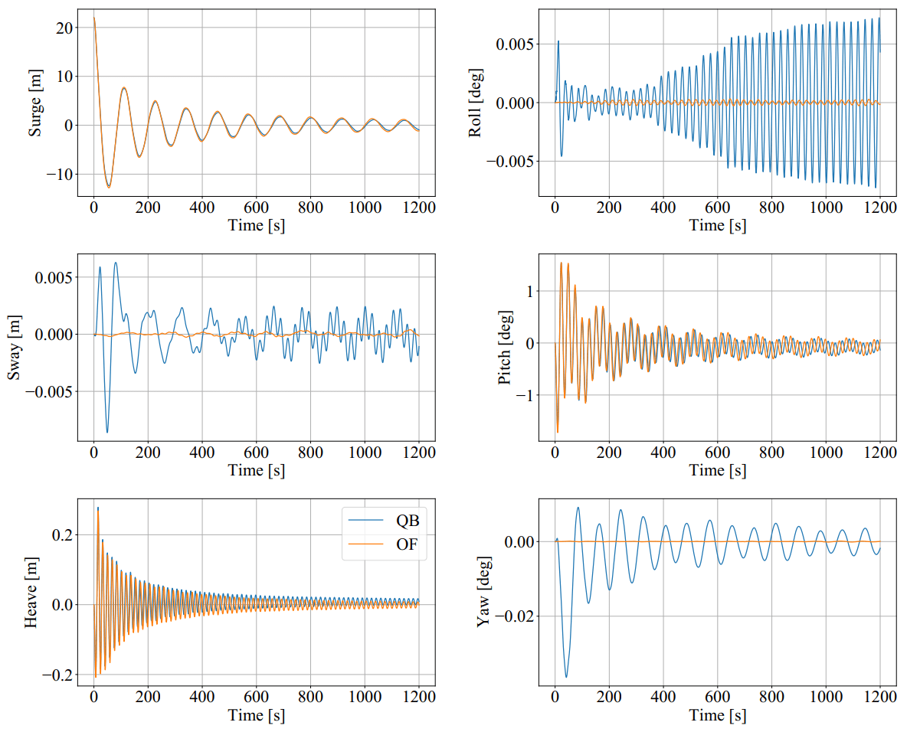
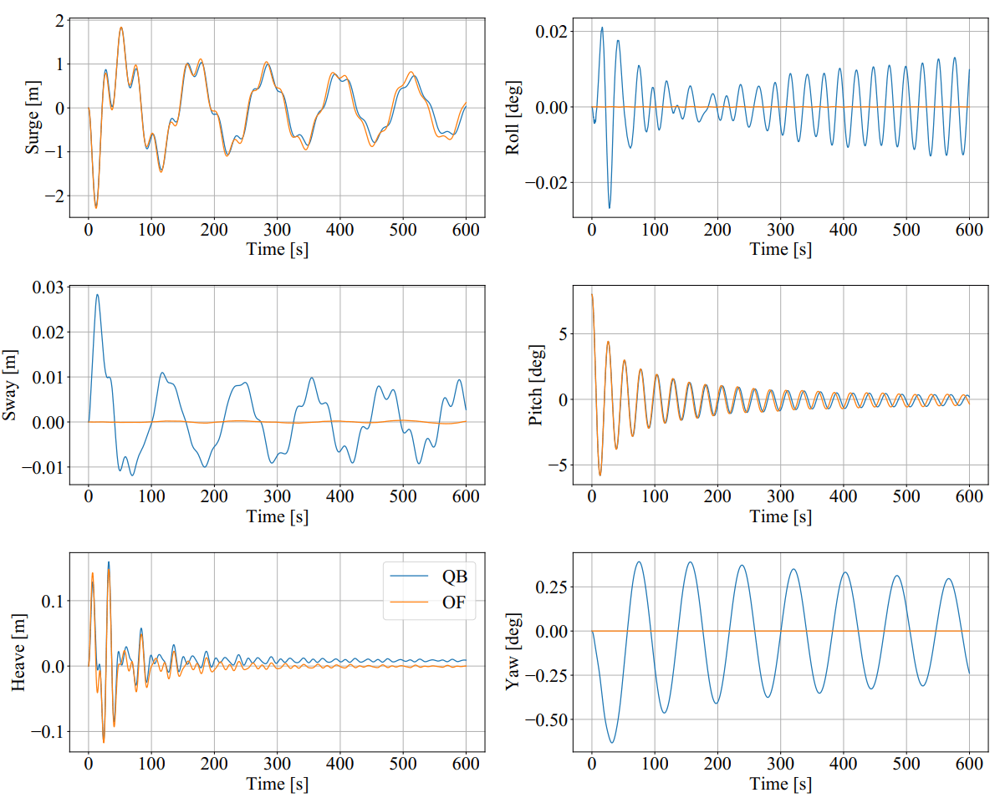
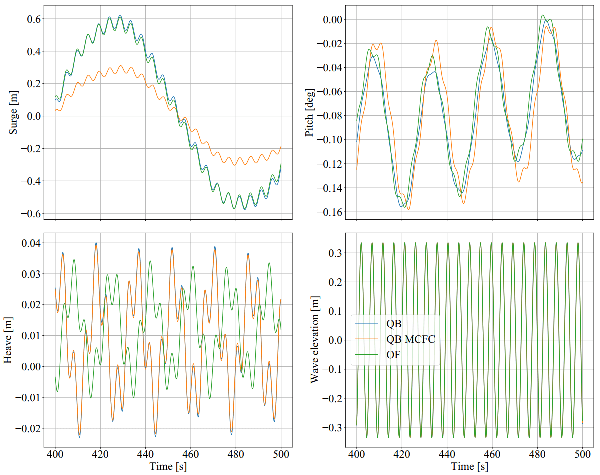
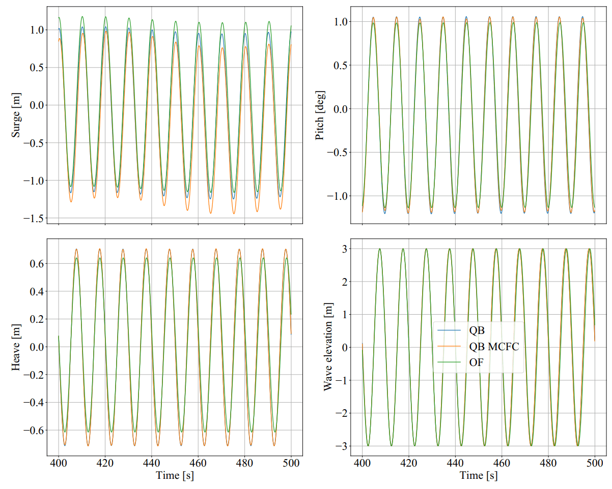
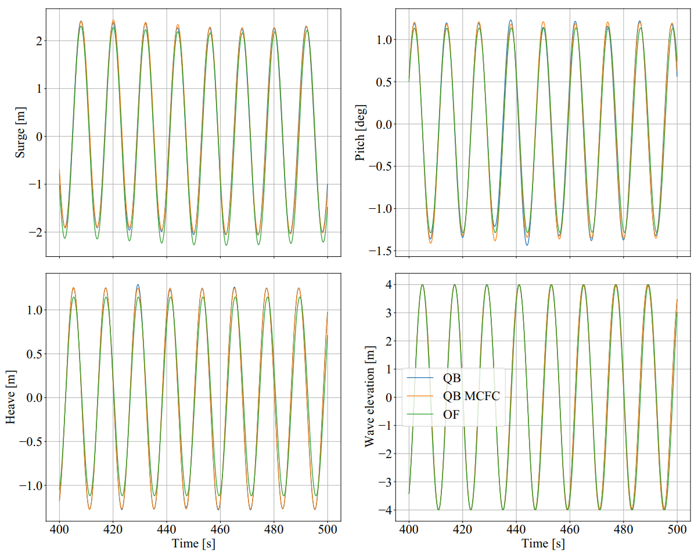

Validation Tests for Morison Equation (ME)
===========================================

The full Morison Equation (ME) model in QBlade (QB) (see :doc:`../../../theory/hydrodynamics/me/me`) was validated in a series of test load cases using a semisubmersible substructure model.
The load cases were chosen with increasing complexity to make sure the individual modules were working correctly. The test cases include decay tests, regular wave tests and irregular wave tests. Again, the
OC4 ME model was considered rigid for these test cases in order to validate the hydrodynamic models.

The results were validated against the open-source aero-hydro-elastic code OpenFAST (OF) :footcite:`OpenFAST` (version 2.5.0). 
The same turbine models and test cases were setup and used in QB and OF. Not all of the hydroelastic modelling capabilities of QB are present in OF. 
When validating certain hydrodynamic models, the hydrodynamic capabilities of QB were adapted to reflect those of OF to have a better comparison.
These modifications are mentioned in the appropriate load cases below.

.. _OC4_ME_Model_Results:

OC4 Semisubmersible ME Model 
------------------------------

The OC4 model was also modelled using the Morison equation only. The geometry of the model is 
shown in :numref:`fig-OC4ME-QB`. The Morison equation modelling has
the advantage of allowing distributed loading during the simulations and hence enable hydroelastic
simulations (see :doc:`../hydroelastics/hydroelastics`). As a drawback, the hydrodynamic coefficients for the Morison equation are obtained
empirically and are constant for all frequencies. This can lead to modelling inaccuracies compared to the
LPMD approach, where the radiation, diffraction and excitation matrices are frequency dependent (see :doc:`../../../theory/hydrodynamics/lpft/lpft`). The
hydrodynamic coefficients for the OC4 ME model were taken from the OC4 Report :footcite:`OC4_Model` with additional coefficients taken from :footcite:`Wendt2015`.

.. _fig-OC4ME-QB:

    The OC4 model displayed in the QB GUI featuring a semisubmersible substructure.

OC4 ME Free Decay Tests
^^^^^^^^^^^^^^^^^^^^^^^^^

The first test cases were free decay tests with still water. To validate the full Morison equation
present in the OC4 ME model, an equivalent ME model was setup in OF. According to the reference :footcite:`Wendt2015`, the ME model in OF is not able to account
for distributed buoyancy. Hence, a linearized buoyancy was used in the OF calculations. This can have a significant
effect in the behavior of the substructure when waves are present (see :ref:`OC4LPMD_RegularWaves`).

:numref:`fig-OC4ME-Decay-Surge` to :numref:`fig-OC4ME-Decay-Pitch` show the time series of the surge, heave and pitch decay tests. We can see that the
models in both codes show a very similar decay behavior. There is a small offset in the heave
position due to the different buoyancy models. Also, if we compare with the free decay test of the OC4
LMPD model (see :ref:`OC4LPMD_FreeDecay`), we can see that the oscillations damp out more slowly in the decay
tests with the OC4 ME model. This is because the OC4 ME model does not have radiation damping forces
which act as an additional linear damping term.

.. _fig-OC4ME-Decay-Surge:

    Time series of the OC4 model surge decay test.

.. _fig-OC4ME-Decay-Heave:

    Time series of the OC4 model heave decay test.

.. _fig-OC4ME-Decay-Pitch:

    Time series of the OC4 model pitch decay test.

We note that the tensions in the mooring system was validated for the OC3 and OC4 models in :doc:`../lpmd/lpmd`, so it won't be repeated here.

:numref:`fig-OC4ME-FreqsDamps` shows the numerical relative values of the eigenfrequencies and damping coefficients of the
decay tests for the surge, heave, pitch and yaw degrees of freedom (DOFs). The eigenfrequencies and dampings were obtained according to the procedure  
presented in :footcite:`OC5_Model`. The linear damping term was ommited since there is no linear damping present in this model. 
We can see in this figure that the values for the
frequencies and damping coefficients are very similar in both codes. There seems to be a discrepancy in
the eigenfrequency of the surge DOF. This difference comes from the method we used to determine the
eigenfrequency. For the surge DOF, the numerical value of the eigenfrequency is low and it is therefore
close to the frequency resolution we used to determine it. In OF and QB, the peaks in the frequency
transform of the signal were shifted in the frequency range by one resolution point. This already
accounted for the difference seen in :numref:`fig-OC4ME-FreqsDamps`. Visual inspection of :numref:`fig-OC4ME-Decay-Surge` already gives an empirical
proof that the frequencies of the surge decay test are very similar.

.. _fig-OC4ME-FreqsDamps:
.. figure:: OC4_FreqsDamps.PNG
    :align: center
    :alt: OC4 Model Normalized Frequencies and Dampings

    Normalized eigenfrequencies and damping behaviour of the OC4 model for the considered decay tests.

OC4 ME Regular Wave Tests
^^^^^^^^^^^^^^^^^^^^^^^^^^^

The regular wave tests were performed with linear waves for two selected cases. One case had a
wave height of :math:`H` = 6 m and a period of :math:`T` = 10 s. The second case had a wave height of :math:`H` = 8 m and a period
of :math:`T` = 12 s.

For these cases, the OC4 ME was adapted to have a linearized buoyancy model and a
linearized mooring system model. Additionally, the wetted surface was considered to go until the mean
sea level instead of the local wave elevation (see :ref:`ME_modeling-considerations`). 
This was done to better compare the QB model with the one
present in the OF calculations. From test cases presented in :doc:`../lpmd/lpmd`, we can consider the buoyancy and mooring
models validated. By aligning the modelling considerations between OB and OF, we can better validate
the full Morison model developed in QB.

Diffraction forces will play a role for Morison elements that have a diameter larger than a fifth of the
wavelength of the incoming wave :footcite:`Faltinsen1993`. For the OC4 ME model, this would be relevant for the large base
and upper columns if the turbine operates at low sea states :footcite:`OC4_Model`. In QB, the full Morison model can be
extended with the MacCamy-Fuchs correction (MCFC) to take into account the diffraction effects :footcite:`IEC61400-3-1`.

The regular wave test cases considered three sea states: the first one characterized by :math:`H` = 0.67 m and :math:`T`
= 4.8 s, the second by :math:`H` = 6 m and :math:`T` = 10 s and the third by :math:`H` = 8 m and :math:`T` = 12 s. The wave direction
was aligned with the positive surge direction. According to :footcite:`OC4_Model`, the diffraction forces will be relevant for
the first sea state.

:numref:`fig-OC4ME-RegWave-Case1` to :numref:`fig-OC4ME-RegWave-Case3` show the surge, pitch and heave DOFs and the wave elevation for the three regular
sea states. We can see in these figures that the results form OF and QB align fairly well in all three sea
states. There are some small differences in the heave response in all three cases. When we enable the
MacCamy-Fuchs correction in QB, we can see that especially the surge DOF is affected in :numref:`fig-OC4ME-RegWave-Case1` and
:numref:`fig-OC4ME-RegWave-Case2`. For the sea state with the smallest wave height, we see the largest differences between the
models with and without the MCFC. For larger wave heights (:numref:`fig-OC4ME-RegWave-Case2`), there are still some differences
between the calculations with and without MCFC. These differences practically vanish for the largest wave
height case (:numref:`fig-OC4ME-RegWave-Case3`). This qualitative behavior corresponds to the expected behavior that the MCFC
mostly affects sea states where the diameter of the Morison element is comparable to the wave length
of the incoming wave.

.. _fig-OC4ME-RegWave-Case1:

    Relevant DOFs and wave elevation for regular sea state with :math:`H` = 0.67 m and :math:`T` = 4.8 s. QB MCFC = QB with MacCamy-Fuchs correction.

.. _fig-OC4ME-RegWave-Case2:

    Relevant DOFs and wave elevation for regular sea state with :math:`H` = 6 m and :math:`T` = 10 s. QB MCFC = QB with MacCamy-Fuchs correction.

.. _fig-OC4ME-RegWave-Case3:

    Relevant DOFs and wave elevation for regular sea state with :math:`H` = 8 m and :math:`T` = 12 s. QB MCFC = QB with MacCamy-Fuchs correction.

OC4 ME Irregular Wave Tests
^^^^^^^^^^^^^^^^^^^^^^^^^^^^^

The OC4 ME was also tested in sea states with irregular waves and compared to the results from OF
simulations. We used six stochastic sea states with a JONSWAP spectrum
(:math:`H_s` = 6, :math:`T_p` = 10 s, :math:`\gamma` = 3.3) and compared the averaged PSD of all DOFs. To have a good alignment of the
modeling assumptions between QB and OF, we again used a linear buoyancy and a linear mooring model.
Also, the wetted surface was assumed to go until the mean sea level and no MCFC was used in the QB
simulations. For the irregular wave tests, the wave direction was aligned with the positive surge direction
and no aerodynamic loads were considered.

.. _fig-OC4ME-IrrWaves-DOFs:

    Averaged PSDs of all DOFs of the OC4 ME model for the irregular sea state with :math:`H_s` = 6 m, :math:`T_p` = 10 s and :math:`\gamma` = 3.3.    

The comparison was done in a statistical manner by comparing the six-simulation-averaged PSD for the
six DOFs. :numref:`fig-OC4ME-IrrWaves-DOFs` shows the results of the irregular sea state test cases. We can see that the responses
of the OF and QB simulations generally agree well. For the QB simulations, we considered simulations
with the three ME implementation options (see :ref:`ME_modeling-considerations`). The first option, QB Loc., considered the
instantaneous local position of the Morison elements to calculate the water particle kinematics. The
second option, QB Filter, considered the low-pass filtered position of the Morison elements to determine
the water particle kinematics. The third option, QB Fixed, considered the fixed initial position of the
Morison elements for the kinematic calculations. The last option is also implemented in OF :footcite:`HydroDyn`.

We can see in :numref:`fig-OC4ME-IrrWaves-DOFs` that all simulations have a comparable PSD behavior for the wave excitation
frequencies (around 0.1 Hz). The higher peaks in the heave and pitch DOFs come from the higher response
of the OC4 ME model to wave excitation forces around these frequencies (see e.g. :numref:`fig-OC4ME-RegWave-Case2`). The strongest
differences are seen for the QB Loc. and OF calculations in the low frequency range. The QB Loc.
calculations show a peak in the eigenfrequencies of the pitch and surge DOFs while the OF calculations
do not. This nonlinear response in pitch disappears for the QB Filter and QB Fixed simulations. It can
therefore be attributed to the local instantaneous approach when calculating the water kinematics. The
surge DOF still shows a peak in the surge eigenfrequency even when filtered or fixed approach is used for
calculating the water kinematics. Further investigation is required to fully understand this phenomenon.